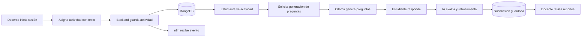
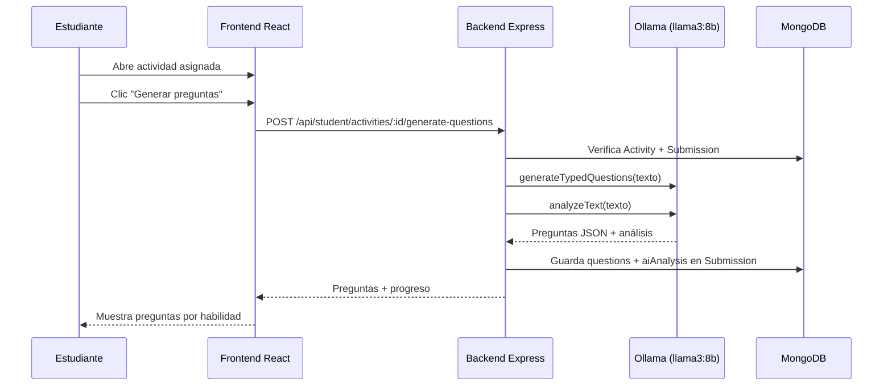
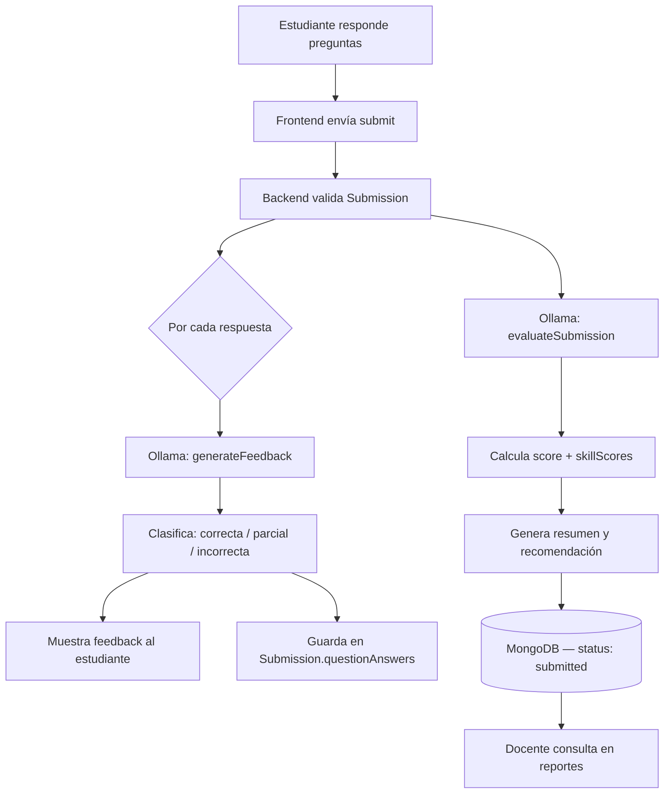
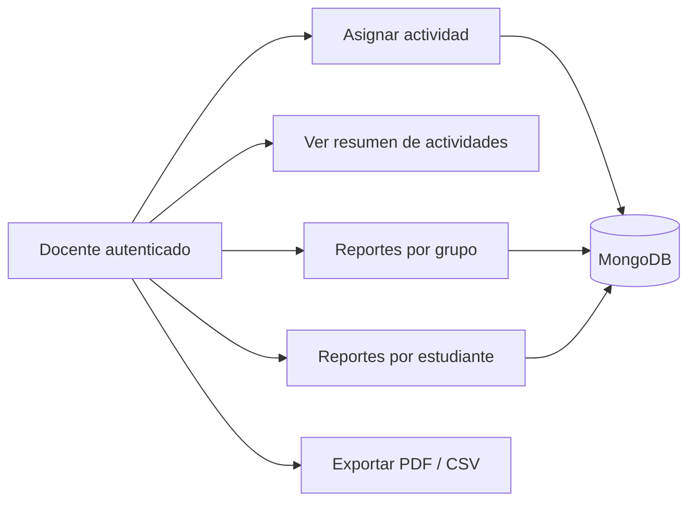
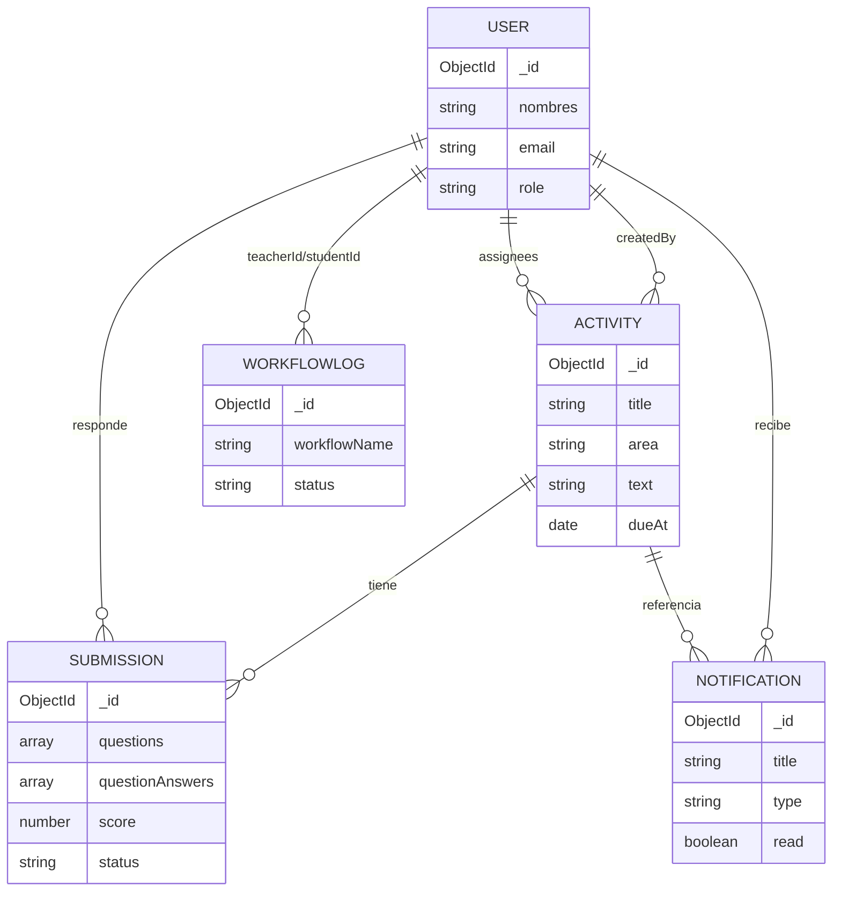
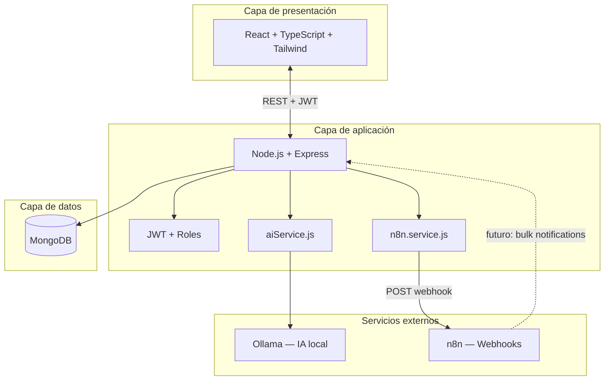

<p align="center">
  
  
  
  
</p>

# 🚀 Implementación y Demostración

## Tutor Virtual de Lectura Comprensiva Escolar

**Institución:** I.E.P. San Carlos  
**Stack:** MERN + IA local (Ollama) + Automatización (n8n)  
**Documento:** Guía técnica para exposición ICACIT — Expositor 4

---

## 📑 Índice

| | Sección |
|---|---------|
| 1 | [Introducción breve](#-1-introducción-breve) |
| 2 | [Flujo principal del sistema](#-2-flujo-principal-del-sistema) |
| 3 | [Generación de preguntas](#-3-generación-de-preguntas) |
| 4 | [Retroalimentación inteligente](#-4-retroalimentación-inteligente) |
| 5 | [Panel docente](#-5-panel-docente) |
| 6 | [Demo rápida — guion 2.5 min](#-6-demo-rápida-guion-de-25-min) |
| 7 | [Tecnologías modernas aplicadas](#-7-tecnologías-modernas-aplicadas) |
| 8 | [Base de datos MongoDB](#-8-base-de-datos-mongodb) |
| 9 | [Arquitectura general](#-9-arquitectura-general) |
| 10 | [Valor académico y tecnológico](#-10-valor-académico-y-tecnológico) |
| 11 | [Cierre — Expositor 4](#-11-cierre-para-expositor-4) |

---

## 🎯 1. Introducción breve

Esta sección demuestra **cómo funciona el sistema en la práctica**: desde que el docente asigna una actividad de lectura, hasta que el estudiante interactúa con la inteligencia artificial para responder preguntas, recibir retroalimentación y que el docente pueda hacer seguimiento desde su panel de reportes.

El Tutor Virtual no es solo una interfaz web: integra **frontend moderno**, **backend con lógica de negocio**, **base de datos NoSQL**, **IA local aplicada al aprendizaje**, **automatización con n8n** y **pruebas automatizadas** que evidencian calidad de software.

<p align="left">
  
  
  
  
  
  
</p>

> **Nota para el expositor:**  
> Esta guía está pensada para leerse en voz alta en **2.5 minutos** y, al mismo tiempo, servir como evidencia técnica escrita para evaluadores ICACIT.

---

## 🔄 2. Flujo principal del sistema

El flujo end-to-end conecta tres actores principales: **docente**, **estudiante** y **motor de IA**, orquestados por el backend MERN.



### Etapas del flujo

| Etapa | Descripción | Componente principal |
|-------|-------------|----------------------|
| **Asignación** | El docente crea una actividad con texto, área curricular y estudiantes | `AssignActivity.tsx` → `POST /api/teacher/activities` |
| **Registro** | Se guarda la actividad y se crea un `Submission` por estudiante | MongoDB (`Activity`, `Submission`) |
| **Automatización** | El backend notifica a n8n del evento `activity_assigned` | `n8n.service.js` |
| **Consumo** | El estudiante accede desde su panel de actividades | `StudentActivities.tsx` |
| **Generación IA** | El sistema genera preguntas tipificadas a partir del texto | Ollama vía `aiService.js` |
| **Respuesta** | El estudiante responde con autosave de borrador | `StudentActivityDetail.tsx` |
| **Evaluación** | La IA analiza cada respuesta y clasifica desempeño | `generateFeedback` + `evaluateSubmission` |
| **Retroalimentación** | Se muestra feedback inmediato al estudiante | `FeedbackPanel.tsx` |
| **Seguimiento** | El docente consulta progreso, reportes PDF/CSV | `TeacherReports.tsx` |

> **Importante:**  
> La creación de la actividad **no depende** de n8n. Si la automatización falla, la actividad igual se guarda; el sistema prioriza la continuidad pedagógica.

---

## 🤖 3. Generación de preguntas

La generación de preguntas es uno de los núcleos del Tutor Virtual. Convierte un **texto de lectura** en **preguntas de comprensión lectora** clasificadas por habilidad.

### ¿Cómo funciona?

1. El docente asigna una actividad con un **texto de lectura** (texto directo, PDF o markdown).
2. El estudiante abre la actividad y solicita **“Generar preguntas con IA”**.
3. El frontend llama a `POST /api/student/activities/:id/generate-questions`.
4. El backend verifica que la actividad esté asignada al estudiante.
5. Se invoca `generateQuestionsWithFallback`: intenta n8n si está configurado; **fallback a Ollama local**.
6. En paralelo, `analyzeText` extrae idea principal, palabras clave, dificultad y consejo de lectura.
7. Las preguntas se guardan en el `Submission` del estudiante (`questionsGenerated: true`).
8. El frontend muestra las preguntas organizadas por tipo de habilidad.



### Tipos de preguntas generadas

| Tipo (`type`) | Habilidad evaluada |
|---------------|-------------------|
| `literal` | Comprensión literal |
| `inferential` | Comprensión inferencial |
| `critical` | Pensamiento crítico |
| `vocabulary` | Vocabulario e interpretación |
| `main_idea` | Idea principal |

### Tecnología de IA

| Aspecto | Detalle |
|---------|---------|
| **Motor** | [Ollama](https://ollama.com/) — IA ejecutada **localmente** |
| **Modelo** | `llama3:8b` (configurable en `.env`) |
| **Servicio** | `src/backend/services/aiService.js` |
| **Endpoint alterno** | `/api/ai/practice` para práctica libre sin actividad asignada |

> **Ventaja pedagógica:**  
> Al usar IA local, el sistema reduce dependencia de APIs externas, mantiene **control del proceso**, permite **personalización del prompt** y protege la privacidad de los textos escolares.

> **Nota:**  
> Existe infraestructura preparada para delegar generación a n8n (`N8N_GENERATE_QUESTIONS_WEBHOOK_URL`), pero el flujo **operativo actual** usa Ollama directamente como motor principal.

---

## 🧠 4. Retroalimentación inteligente

Tras responder las preguntas, el estudiante recibe **retroalimentación inmediata** generada por IA, clasificada y persistida para reportes docentes.

### Flujo de retroalimentación



### Componentes involucrados

| Componente | Función |
|------------|---------|
| **Frontend** | Captura respuestas, muestra feedback por pregunta (`FeedbackPanel.tsx`) |
| **Backend** | Orquesta evaluación en `POST /api/student/activities/:id/submit` |
| **Ollama** | Genera feedback por pregunta y evaluación global |
| **MongoDB** | Persiste respuestas, clasificación y puntajes en `Submission` |
| **Autosave** | Guarda borradores sin perder avance (`save-draft`, `autosave`) |

### Clasificación de respuestas

| Estado | Criterio | Utilidad pedagógica |
|--------|----------|---------------------|
| **Correcta** | La respuesta demuestra comprensión adecuada del texto | Refuerza logro y motivación |
| **Parcial** | Hay comprensión incompleta o respuesta imprecisa | Orienta qué profundizar |
| **Incorrecta** | No responde al criterio esperado | Indica vacío de comprensión a reforzar |

Adicionalmente, el sistema calcula **`skillScores`** por habilidad (literal, inferencial, crítico, vocabulario, idea principal) y genera un **`feedbackSummary`**, **`recommendation`** y **`motivation`** para el estudiante.

> **Recomendación para la demo:**  
> Mostrar una respuesta **correcta** y una **parcial/incorrecta** para evidenciar que la retroalimentación no es genérica, sino contextual al texto y a la pregunta.

---

## 👨‍🏫 5. Panel docente

El panel docente centraliza la **gestión académica** y el **seguimiento del aprendizaje** de los estudiantes.



### Funcionalidades implementadas

| Funcionalidad | Descripción | Ruta / componente |
|---------------|-------------|-------------------|
| **Asignar actividad** | Crear lectura, elegir área, fecha límite y estudiantes | `/teacher/assign` · `AssignActivity.tsx` |
| **Seleccionar alumnos** | Búsqueda y selección múltiple de estudiantes | `StudentSelector.tsx` |
| **Cargar PDF** | Extracción de texto desde PDF para la actividad | `POST /api/teacher/extract-pdf` |
| **Resumen de actividades** | Vista general de actividades creadas | `TeacherDashboard.tsx` |
| **Reportes de grupo** | Métricas agregadas: entregas, promedios, pendientes | `TeacherReports.tsx` |
| **Reportes por alumno** | Desempeño individual con evidencias | Export PDF formal ICACIT |
| **Exportación** | PDF institucional y CSV de datos | `reportPdfService.js` |

### Roles del sistema

| Rol | Acceso principal |
|-----|------------------|
| **teacher** | Asignar actividades, reportes docentes |
| **student** | Actividades, práctica IA, progreso, notificaciones |
| **admin** | Acceso extendido a rutas de docente y estudiante |

> **Nota:**  
> Las notificaciones in-app para estudiantes (campana en header) se crean al asignar actividades. La integración n8n está documentada en [`N8N_INTEGRATION_GUIDE.md`](./N8N_INTEGRATION_GUIDE.md).

---

## 🎬 6. Demo rápida (guion de 2.5 min)

### Qué mostrar en pantalla

| Orden | Pantalla | Evidencia |
|-------|----------|-----------|
| 1 | Login docente | Autenticación JWT, roles |
| 2 | Asignar actividad | Texto, área, estudiantes, fecha |
| 3 | Confirmación + n8n Executions | Automatización (opcional) |
| 4 | Login estudiante | Cambio de rol |
| 5 | Mis actividades → detalle | Actividad asignada visible |
| 6 | Generar preguntas | IA local (Ollama) en acción |
| 7 | Responder + enviar | Interacción del estudiante |
| 8 | Retroalimentación | Feedback por pregunta |
| 9 | Panel docente → Reportes | PDF / métricas de seguimiento |

---

### Guion sugerido — Expositor 4

#### **0:00 – 0:25 · Presentación del flujo**

> “En esta sección mostramos la implementación real del Tutor Virtual. El sistema conecta al docente, al estudiante y a un motor de inteligencia artificial local. El flujo inicia cuando el docente asigna una lectura; el estudiante genera preguntas con IA, responde y recibe retroalimentación inmediata; y el docente hace seguimiento desde su panel de reportes.”

#### **0:25 – 0:55 · Asignación docente**

> “Ingresamos como docente y creamos una actividad: definimos título, área curricular, texto de lectura y seleccionamos a los estudiantes. Al confirmar, el backend guarda la actividad en MongoDB y dispara un evento de automatización hacia n8n. La actividad queda disponible al instante para el estudiante, independientemente de la automatización.”

#### **0:55 – 1:25 · Generación de preguntas con IA**

> “Como estudiante, abrimos la actividad y solicitamos la generación de preguntas. El backend envía el texto a Ollama, nuestro motor de IA local, que produce preguntas de comprensión literal, inferencial, crítica, vocabulario e idea principal. Simultáneamente, el sistema analiza el texto y entrega un resumen pedagógico al estudiante.”

#### **1:25 – 1:55 · Respuesta y retroalimentación**

> “El estudiante responde las preguntas. Al enviar, la IA evalúa cada respuesta y la clasifica como correcta, parcial o incorrecta, entregando un mensaje de retroalimentación personalizado. Los resultados se almacenan en la base de datos junto con puntajes por habilidad, listos para el seguimiento docente.”

#### **1:55 – 2:20 · Panel docente y reportes**

> “Volviendo al rol docente, accedemos al módulo de reportes. Aquí consultamos el avance del grupo o de un estudiante específico, revisamos entregas pendientes y exportamos un reporte PDF formal con evidencias de desempeño. Esto permite una evaluación formativa basada en datos.”

#### **2:20 – 2:30 · Cierre**

> “Con esta demostración evidenciamos una arquitectura MERN moderna, IA aplicada al aprendizaje, automatización con n8n y trazabilidad completa del proceso pedagógico — desde la asignación hasta la retroalimentación y el reporte docente.”

---

### Comandos para levantar la demo

```bash
# Terminal 1 — Backend
pnpm run dev:backend

# Terminal 2 — Frontend
pnpm run dev:frontend

# Terminal 3 — n8n (opcional, automatización)
n8n start

# Terminal 4 — Ollama (IA local)
ollama serve
```

> **Recomendación:**  
> Verificar antes de la exposición que Ollama tenga el modelo `llama3:8b` descargado (`ollama pull llama3:8b`) y que MongoDB esté activo.

---

## 🧩 7. Tecnologías modernas aplicadas

<p align="center">
  
</p>

| Tecnología | Tipo | Función en el proyecto |
|------------|------|------------------------|
| **React 19** | Frontend | Interfaces dinámicas por rol (docente / estudiante) |
| **TypeScript** | Frontend | Tipado estático y mantenibilidad |
| **Vite 7** | Build tool | Desarrollo rápido y compilación del frontend |
| **Tailwind CSS 4** | UI | Diseño responsive y moderno |
| **Node.js 20** | Backend | Runtime del servidor |
| **Express 5** | Backend framework | Rutas REST, middlewares, controladores |
| **MongoDB 8** | Base de datos NoSQL | Persistencia flexible de documentos |
| **Mongoose** | ODM | Modelado de esquemas y relaciones |
| **Ollama + llama3:8b** | IA local | Generación de preguntas, análisis y retroalimentación |
| **n8n** | Automatización | Workflow *Activity Assigned Notification* (webhook) |
| **JWT** | Seguridad | Autenticación stateless por roles |
| **pnpm** | Monorepo | Gestión de paquetes backend + frontend |
| **Jest** | Testing | Pruebas unitarias e integración (API + servicios) |
| **Cypress** | E2E | Pruebas de flujo completo en navegador |
| **Newman** | API testing | Colecciones Postman automatizadas |
| **GitHub Actions** | CI/CD | Pipeline de calidad en cada push/PR |
| **Docker Compose** | Infraestructura | Orquestación opcional de servicios |

> **Nota:**  
> Solo se listan tecnologías **presentes en el repositorio**. Flujos n8n adicionales (recordatorios, reportes semanales) están preparados como JSON exportable pero **no publicados** aún.

---

## 🗃️ 8. Base de datos MongoDB

### ¿Por qué MongoDB?

MongoDB es una base de datos **NoSQL orientada a documentos**. Almacena información en **colecciones** de documentos similares a JSON (BSON internamente).

> **Defensa oral sugerida:**  
> “MongoDB fue elegido porque el sistema maneja usuarios, actividades, preguntas embebidas, respuestas, puntajes y reportes con estructuras flexibles. Al ser una base de datos NoSQL orientada a documentos, permite almacenar datos relacionados en formato similar a JSON, facilitando el desarrollo dentro del stack MERN y adaptándose a la evolución del modelo pedagógico.”

### Ventajas en este proyecto

| Ventaja | Aplicación |
|---------|------------|
| **Flexibilidad de esquema** | Preguntas y respuestas embebidas en `Submission` sin joins complejos |
| **Integración JavaScript** | Mismo lenguaje en frontend, backend y consultas Mongoose |
| **Escalabilidad horizontal** | Preparado para crecer en usuarios y actividades |
| **Documentos anidados** | `questionAnswers`, `skillScores`, `aiAnalysis` en un solo documento |

### Modelo conceptual



### Colecciones / modelos reales

| Modelo Mongoose | Colección | Propósito |
|-----------------|-----------|-----------|
| `User` | `users` | Docentes, estudiantes y administradores |
| `Activity` | `activities` | Lecturas asignadas con texto, área y destinatarios |
| `Submission` | `submissions` | Trabajo del estudiante: preguntas, respuestas, feedback, puntajes |
| `Notification` | `notifications` | Notificaciones in-app (ej. actividad asignada) |
| `WorkflowLog` | `workflowlogs` | Registro de ejecuciones n8n |
| `Answer` | `answers` | Retroalimentación legacy en práctica libre (`/api/ai/feedback`) |
| `Question` | `questions` | Modelo legacy para textos con preguntas almacenadas |

> **Importante:**  
> El modelo **`Submission`** es el núcleo del flujo estudiante: concentra preguntas generadas, respuestas, retroalimentación y evaluación en un solo documento por `(activity, student)`.

---

## 🏗️ 9. Arquitectura general



### Responsabilidad por capa

| Capa | Responsabilidad |
|------|-----------------|
| **Frontend React** | Experiencia de usuario, formularios, dashboards, visualización de feedback |
| **Backend Express** | Lógica de negocio, validación, orquestación IA, seguridad |
| **MongoDB** | Persistencia de usuarios, actividades, entregas, notificaciones y logs |
| **Ollama** | Procesamiento de lenguaje natural: preguntas, análisis, evaluación |
| **n8n** | Automatización desacoplada: evento de actividad asignada |

### Estructura del monorepo

```
proyecto-mern-ia/
├── src/frontend/          # React + Vite + TypeScript
├── src/backend/           # Express + Mongoose + Ollama
├── src/n8n-automation/    # Workflows y docs n8n
├── tests/                 # Jest (unit + integration)
├── cypress/               # E2E
├── docs/                  # Documentación adicional (UML, informes)
├── IMPLEMENTACION_Y_DEMOSTRACION_ICACIT.md
├── N8N_INTEGRATION_GUIDE.md
```

---

## 💡 10. Valor académico y tecnológico

Esta implementación aporta valor demostrable para una evaluación ICACIT porque:

| Dimensión | Evidencia |
|-----------|-----------|
| **Integración tecnológica** | Stack MERN completo + IA + automatización en un solo producto funcional |
| **IA aplicada al aprendizaje** | Generación de preguntas y retroalimentación contextual, no respuestas genéricas |
| **Automatización de procesos** | n8n recibe eventos académicos sin bloquear el flujo principal |
| **Arquitectura escalable** | Capas desacopladas: frontend, backend, datos, IA y automatización |
| **Experiencia de usuario** | Interfaces por rol, autosave, notificaciones, reportes exportables |
| **Soporte pedagógico** | Seguimiento por habilidades de comprensión lectora (literal → crítico) |
| **Calidad de software** | Jest, Cypress, Newman, CI en GitHub Actions |
| **Trazabilidad** | Cada entrega queda registrada con puntajes, feedback y timestamps |

> **Importante para evaluadores:**  
> El sistema no es un prototipo estático: es una aplicación **ejecutable**, con **datos persistentes**, **IA operativa** y **evidencias exportables** (PDF/CSV) que respaldan el proceso de enseñanza-aprendizaje.

---

## 🎤 11. Cierre para Expositor 4

> “En esta demostración hemos evidenciado cómo el Tutor Virtual integra frontend, backend, base de datos MongoDB, inteligencia artificial local y automatización con n8n para fortalecer la comprensión lectora. El docente asigna, el estudiante aprende con retroalimentación inmediata, y el sistema registra evidencias para un seguimiento pedagógico riguroso. Esto demuestra una solución educativa moderna, implementada con tecnologías actuales y orientada al impacto en el aula.”

---

## 📎 Anexo — Estado de implementación

| Funcionalidad | Estado | Notas |
|---------------|--------|-------|
| Asignación de actividades | ✅ Implementado | PDF, áreas curriculares, múltiples estudiantes |
| Generación de preguntas (Ollama) | ✅ Implementado | 5 tipos de habilidades |
| Retroalimentación por respuesta | ✅ Implementado | correcta / parcial / incorrecta |
| Evaluación global + skillScores | ✅ Implementado | Al enviar actividad |
| Panel docente + reportes PDF | ✅ Implementado | Grupo e individual |
| Notificaciones in-app | ✅ Implementado | Campana + panel estudiante |
| n8n Activity Assigned | ✅ Integrado | Webhook → Edit Fields → Respond |
| n8n → notificaciones bulk | 🔶 Parcial | Backend preparado; workflow n8n pendiente de HTTP node |
| Recordatorios / reportes n8n | 📌 Futuro | JSON exportable, no publicado |
| Detección de sesgos (IA) | ✅ Implementado | `/api/ai/biases` |

---

<p align="center">
  
  
  
</p>

<p align="center"><em>Documento técnico-profesional — Sección 4: Implementación y Demostración (2.5 min)</em></p>
