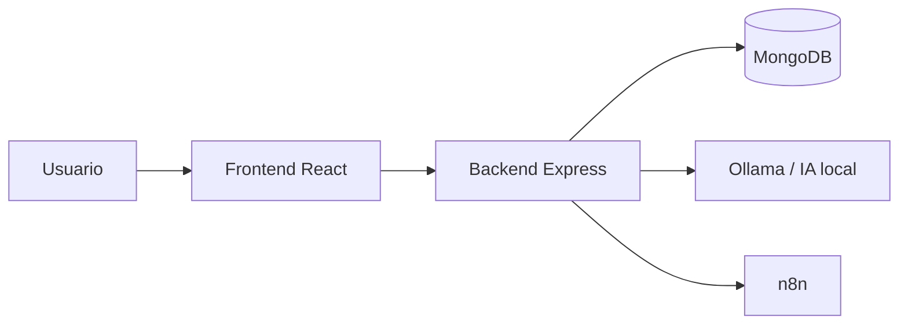
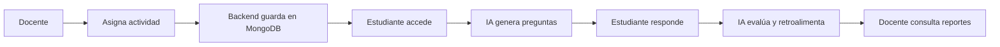
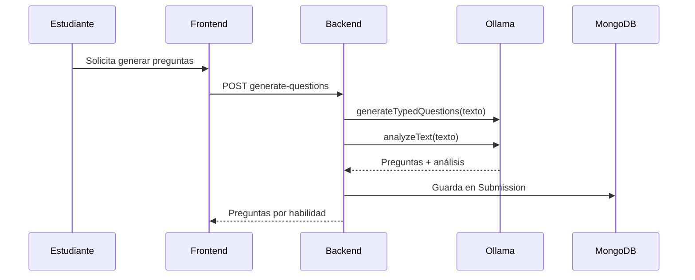
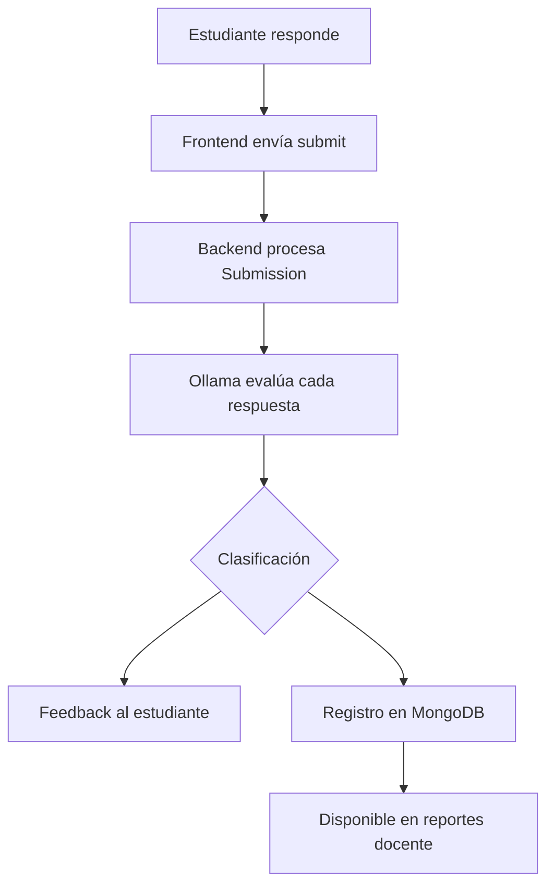
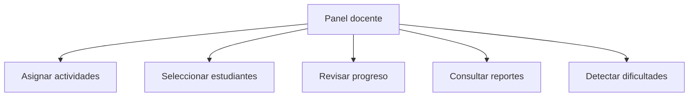
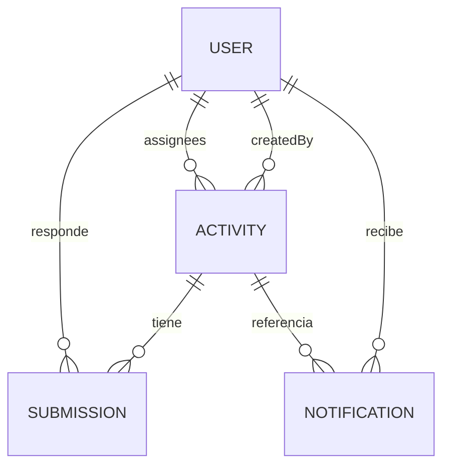

<p align="center">
  
  
  
</p>

# Implementación y Demostración

## Tutor Virtual de Lectura Comprensiva Escolar

**Institución:** I.E.P. San Carlos  
**Stack:** MERN + IA local (Ollama) + Automatización (n8n)

Documento de síntesis sobre la **implementación real** del sistema: arquitectura, flujos operativos, uso de tecnologías modernas y evidencia funcional verificable.

> Documento complementario: [`IMPLEMENTACION_Y_DEMOSTRACION_ICACIT.md`](./IMPLEMENTACION_Y_DEMOSTRACION_ICACIT.md) · [`N8N_INTEGRATION_GUIDE.md`](./N8N_INTEGRATION_GUIDE.md)

---

## Índice

| | Sección |
|---|---------|
| 1 | [Alcance de la implementación](#1-alcance-de-la-implementación) |
| 2 | [Arquitectura general](#2-arquitectura-general) |
| 3 | [Flujo principal del sistema](#3-flujo-principal-del-sistema) |
| 4 | [Generación de preguntas con IA](#4-generación-de-preguntas-con-ia) |
| 5 | [Retroalimentación inteligente](#5-retroalimentación-inteligente) |
| 6 | [Panel docente y seguimiento](#6-panel-docente-y-seguimiento) |
| 7 | [Base de datos MongoDB](#7-base-de-datos-mongodb) |
| 8 | [Automatización con n8n](#8-automatización-con-n8n) |
| 9 | [Tecnologías modernas aplicadas](#9-tecnologías-modernas-aplicadas) |
| 10 | [Verificación operativa del sistema](#10-verificación-operativa-del-sistema) |
| 11 | [Estado de implementación](#11-estado-de-implementación) |

---

## 1. Alcance de la implementación

El Tutor Virtual es una aplicación web que integra **frontend moderno**, **backend con lógica de negocio**, **base de datos NoSQL**, **inteligencia artificial local** y **automatización externa** para fortalecer la comprensión lectora en el ámbito escolar.

Esta implementación evidencia:

- Asignación de actividades de lectura por parte del docente.
- Generación automática de preguntas mediante IA.
- Retroalimentación inmediata al estudiante.
- Seguimiento académico mediante panel docente y reportes.
- Persistencia de datos y trazabilidad del proceso pedagógico.
- Automatización de eventos académicos mediante n8n.

---

## 2. Arquitectura general

El sistema se organiza en capas desacopladas que permiten escalabilidad, mantenimiento y extensión funcional.

| Capa | Tecnología | Responsabilidad |
|------|------------|-----------------|
| **Presentación** | React + TypeScript + Tailwind | Interfaz para docentes y estudiantes |
| **Aplicación** | Node.js + Express | API REST, autenticación JWT, orquestación |
| **Datos** | MongoDB + Mongoose | Persistencia de usuarios, actividades y entregas |
| **Inteligencia artificial** | Ollama (llama3:8b) | Generación de preguntas, análisis y evaluación |
| **Automatización** | n8n | Recepción de eventos al asignar actividades |



```
[Docente / Estudiante]
        ↓
[Frontend React]
        ↓
[Backend Node.js + Express]
        ↓
    [MongoDB]

Backend → Ollama (IA local)
Backend → n8n (automatización)
```

> **Nota:** n8n opera como servicio externo. No reemplaza al backend ni al frontend; complementa el flujo principal con automatización desacoplada.

---

## 3. Flujo principal del sistema

El flujo operativo conecta al docente, al estudiante y al motor de IA en un ciclo completo de enseñanza-aprendizaje.



| Etapa | Descripción |
|-------|-------------|
| **Asignación** | El docente crea una actividad con texto de lectura y la asigna a estudiantes |
| **Registro** | El backend persiste la actividad y crea un registro de entrega por estudiante |
| **Consumo** | El estudiante visualiza la actividad desde su panel |
| **Generación IA** | El sistema produce preguntas tipificadas a partir del texto |
| **Respuesta** | El estudiante responde con guardado automático de borrador |
| **Evaluación** | La IA analiza respuestas y clasifica el desempeño |
| **Retroalimentación** | Se entrega feedback contextual al estudiante |
| **Seguimiento** | El docente consulta progreso, métricas y reportes exportables |

> **Importante:** La creación de actividades no depende de n8n. Si la automatización falla, el flujo pedagógico principal continúa operando.

---

## 4. Generación de preguntas con IA

La generación de preguntas transforma un texto de lectura en una actividad interactiva orientada a distintas habilidades de comprensión lectora.

### Proceso

| Fase | Detalle |
|------|---------|
| **Entrada** | Texto de lectura asignado por el docente |
| **Procesamiento** | Backend invoca `aiService.js` → Ollama |
| **Salida** | 5–8 preguntas clasificadas por habilidad |
| **Persistencia** | Preguntas almacenadas en el modelo `Submission` |
| **Endpoint** | `POST /api/student/activities/:id/generate-questions` |



### Tipos de preguntas generadas

| Tipo | Habilidad evaluada |
|------|-------------------|
| `literal` | Comprensión literal |
| `inferential` | Comprensión inferencial |
| `critical` | Pensamiento crítico |
| `vocabulary` | Vocabulario e interpretación |
| `main_idea` | Idea principal |

### Motor de IA

- **Tecnología:** Ollama — ejecución **local** del modelo `llama3:8b`.
- **Ventaja:** Control del proceso, personalización pedagógica y menor dependencia de servicios externos.
- **Alternativa preparada:** Infraestructura para delegar generación a n8n; el flujo operativo actual usa Ollama como motor principal.

---

## 5. Retroalimentación inteligente

Tras responder las preguntas, el estudiante recibe retroalimentación generada por IA, clasificada y registrada para seguimiento docente.



| Componente | Función |
|------------|---------|
| **Frontend** | Captura respuestas y muestra feedback (`FeedbackPanel.tsx`) |
| **Backend** | Orquesta evaluación en `POST /api/student/activities/:id/submit` |
| **Ollama** | Genera feedback por pregunta y evaluación global |
| **MongoDB** | Persiste respuestas, clasificación y puntajes en `Submission` |

### Clasificación de respuestas

| Estado | Significado pedagógico |
|--------|------------------------|
| **Correcta** | Comprensión adecuada del texto |
| **Parcial** | Comprensión incompleta o imprecisa |
| **Incorrecta** | Respuesta que no cumple el criterio esperado |

Adicionalmente, el sistema calcula **puntajes por habilidad** (`skillScores`), un **resumen de feedback**, **recomendaciones** y **mensajes motivacionales** para el estudiante.

---

## 6. Panel docente y seguimiento

El panel docente centraliza la gestión académica y el monitoreo del aprendizaje.



| Funcionalidad | Descripción | Componente |
|---------------|-------------|------------|
| **Asignar actividad** | Crear lectura, área curricular, fecha límite | `AssignActivity.tsx` |
| **Cargar PDF** | Extracción de texto desde archivo PDF | `POST /api/teacher/extract-pdf` |
| **Seleccionar alumnos** | Asignación individual o grupal | `StudentSelector.tsx` |
| **Revisar progreso** | Avance por actividad y estudiante | `TeacherDashboard.tsx` |
| **Reportes de grupo** | Métricas agregadas de entregas y promedios | `TeacherReports.tsx` |
| **Reportes por alumno** | Desempeño individual con evidencias | Export PDF formal |
| **Exportación** | PDF institucional y CSV | `reportPdfService.js` |

### Roles del sistema

| Rol | Acceso |
|-----|--------|
| `teacher` | Asignación de actividades, reportes, seguimiento |
| `student` | Actividades, práctica IA, progreso, notificaciones |
| `admin` | Acceso extendido a funcionalidades docente y estudiante |

---

## 7. Base de datos MongoDB

MongoDB es una base de datos **NoSQL orientada a documentos**. Almacena información en colecciones de documentos con estructura similar a JSON (BSON internamente).

> MongoDB fue elegido porque el sistema maneja usuarios, actividades, preguntas embebidas, respuestas, retroalimentaciones y reportes con estructuras flexibles. Al ser una base de datos orientada a documentos, facilita el desarrollo dentro del stack MERN y se adapta a la evolución del modelo pedagógico.



| Modelo | Colección | Propósito |
|--------|-----------|-----------|
| `User` | `users` | Docentes, estudiantes y administradores |
| `Activity` | `activities` | Lecturas asignadas con texto, área y destinatarios |
| `Submission` | `submissions` | Preguntas, respuestas, feedback y puntajes del estudiante |
| `Notification` | `notifications` | Notificaciones in-app |
| `WorkflowLog` | `workflowlogs` | Registro de ejecuciones n8n |
| `Answer` | `answers` | Retroalimentación en práctica libre (`/api/ai/feedback`) |

> El modelo **`Submission`** concentra el núcleo del flujo estudiante: preguntas generadas, respuestas, retroalimentación y evaluación en un documento por `(activity, student)`.

---

## 8. Automatización con n8n

n8n funciona como **capa externa de automatización**. Cuando el docente asigna una actividad, el backend envía un evento al webhook de n8n mediante `N8N_ACTIVITY_ASSIGNED_WEBHOOK_URL`.

### Flujo implementado

**Workflow:** Activity Assigned Notification (publicado)

```
Webhook → Edit Fields → Respond to Webhook
```

| Nodo | Función |
|------|---------|
| **Webhook** | Recibe evento `activity_assigned` desde el backend |
| **Edit Fields** | Organiza título, área, docente y estudiantes |
| **Respond to Webhook** | Confirma recepción al backend |

### Integración vs automatización extendida

| Aspecto | Estado |
|---------|--------|
| Backend → n8n (webhook) | Implementado |
| n8n recibe y procesa evento | Implementado |
| Notificaciones in-app vía backend | Implementado (respaldo al asignar) |
| n8n → `POST /api/notifications/bulk` | Base preparada; nodo HTTP pendiente en workflow |
| Recordatorios / reportes semanales n8n | Mejora futura (JSON exportable) |

> **Nota:** El flujo publicado recibe, transforma y responde el evento. No envía correos ni recordatorios automáticos en la versión actual.

---

## 9. Tecnologías modernas aplicadas

<p align="center">
  
</p>

| Tecnología | Tipo | Función en el proyecto |
|------------|------|------------------------|
| **React 19** | Frontend | Interfaces dinámicas por rol |
| **TypeScript** | Frontend | Tipado estático y mantenibilidad |
| **Vite** | Build | Compilación y desarrollo frontend |
| **Tailwind CSS** | UI | Diseño responsive |
| **Node.js** | Backend | Runtime del servidor |
| **Express 5** | Backend | Rutas REST y middlewares |
| **MongoDB** | Base de datos | Persistencia NoSQL |
| **Mongoose** | ODM | Modelado de esquemas |
| **Ollama** | IA local | Generación, análisis y evaluación |
| **n8n** | Automatización | Workflow Activity Assigned Notification |
| **JWT** | Seguridad | Autenticación por roles |
| **pnpm** | Monorepo | Gestión backend + frontend |
| **Jest** | Testing | Pruebas unitarias e integración |
| **Cypress** | E2E | Pruebas de flujo en navegador |
| **Newman** | API testing | Colecciones Postman automatizadas |
| **GitHub Actions** | CI/CD | Pipeline de calidad continua |

---

## 10. Verificación operativa del sistema

El sistema puede verificarse mediante recorrido funcional completo en entorno local.

| Paso | Acción | Evidencia |
|------|--------|-----------|
| 1 | Autenticación como docente | JWT + rol `teacher` |
| 2 | Crear y asignar actividad con texto | Actividad en MongoDB |
| 3 | Evento hacia n8n | Ejecución en n8n Executions |
| 4 | Autenticación como estudiante | Rol `student` |
| 5 | Generar preguntas con IA | Preguntas tipificadas visibles |
| 6 | Responder y enviar actividad | Clasificación y feedback |
| 7 | Consultar reportes docente | PDF / métricas de desempeño |

### Requisitos de entorno

```bash
pnpm run dev          # Backend + frontend
ollama serve          # Motor de IA local
n8n start             # Automatización (opcional)
```

---

## 11. Estado de implementación

| Funcionalidad | Estado |
|---------------|--------|
| Asignación de actividades (texto, PDF, estudiantes) | ✅ Implementado |
| Generación de preguntas con Ollama | ✅ Implementado |
| Retroalimentación (correcta / parcial / incorrecta) | ✅ Implementado |
| Evaluación global y puntajes por habilidad | ✅ Implementado |
| Panel docente y reportes PDF/CSV | ✅ Implementado |
| Notificaciones in-app para estudiantes | ✅ Implementado |
| Integración n8n — Activity Assigned | ✅ Implementado |
| n8n → notificaciones bulk | 🔶 Base preparada |
| Recordatorios y reportes n8n | 📌 Mejora futura |
| Pruebas automatizadas (Jest, Cypress, CI) | ✅ Implementado |

---

## Valor académico y tecnológico

Esta implementación demuestra:

- **Integración de tecnologías modernas** en un producto funcional orientado a la educación.
- **IA aplicada al aprendizaje** con generación de preguntas y retroalimentación contextual.
- **Automatización desacoplada** mediante n8n sin comprometer el flujo principal.
- **Arquitectura escalable** con capas claramente definidas.
- **Trazabilidad pedagógica** mediante persistencia de entregas, puntajes y reportes exportables.
- **Calidad de software** respaldada por pruebas automatizadas e integración continua.

---

<p align="center">
  
  
  
</p>

<p align="center"><em>Implementación y demostración — Tutor Virtual de Lectura Comprensiva Escolar</em></p>
