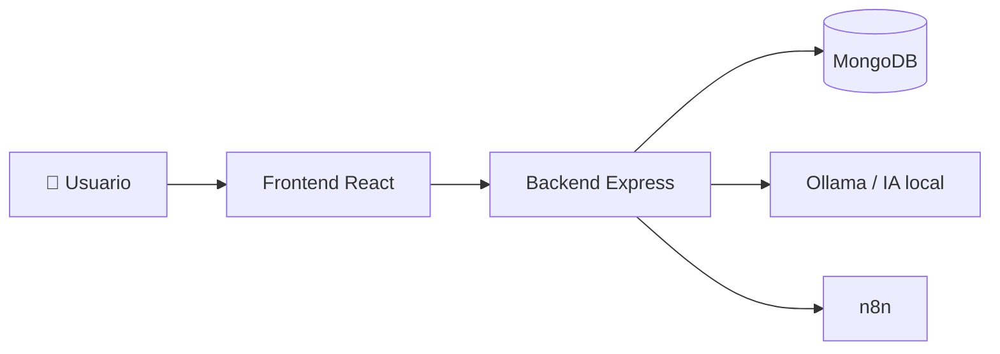
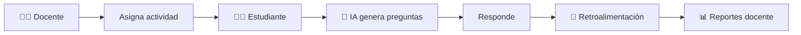
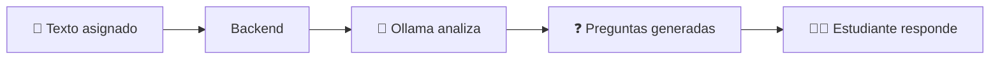
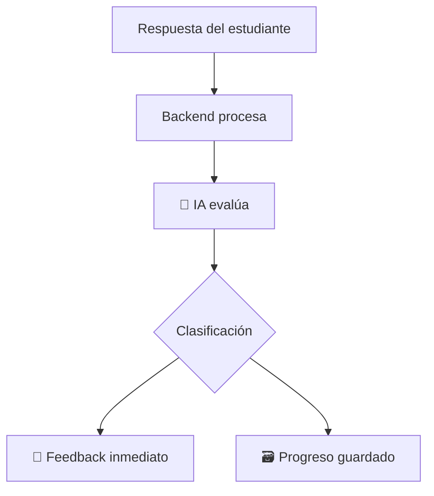
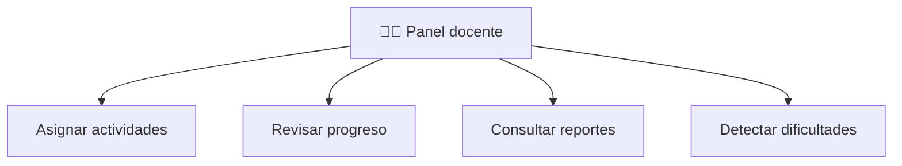
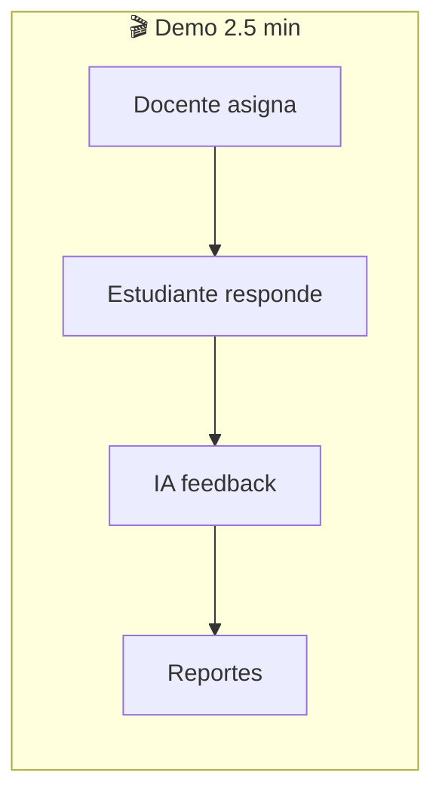

# PPT — Implementación y Demostración ICACIT

**Sección 4 · Expositor 4 · ~2.5 min**  
**Proyecto:** Tutor Virtual de Lectura Comprensiva Escolar  
**Fuente:** [`IMPLEMENTACION_Y_DEMOSTRACION_ICACIT.md`](./IMPLEMENTACION_Y_DEMOSTRACION_ICACIT.md)

---

> Copia cada bloque **“Texto para la lámina”** directamente en PowerPoint o Canva.  
> Usa **máximo 4–5 líneas** por diapositiva. El guion oral va en notas del presentador.

---

## Diapositiva 1: Arquitectura general del sistema

### Texto para la lámina (≤ 25 palabras)

> Arquitectura web moderna: React, Express, MongoDB, Ollama y n8n conectados para lectura, IA y automatización académica.

### Contenido extendido (notas)

| Capa | Tecnología | Función |
|------|------------|---------|
| 🖥️ Frontend | React + TypeScript | Interfaz docente y estudiante |
| ⚙️ Backend | Node.js + Express | Lógica, API REST, seguridad JWT |
| 🗃️ Datos | MongoDB | Usuarios, actividades, entregas |
| 🤖 IA | Ollama (local) | Preguntas y retroalimentación |
| 🔄 Automatización | n8n | Eventos al asignar actividades |

### Diagrama sugerido



**Versión textual (Canva):**

```
[Docente / Estudiante]
        ↓
[Frontend React]
        ↓
[Backend Node.js + Express]
        ↓
    [MongoDB]

Backend → Ollama (IA local)
Backend → n8n (automatización)
```

### Idea visual

- Bloques rectangulares con bordes redondeados.
- Colores: azul (frontend), gris oscuro (backend), verde (MongoDB), morado (IA), rosa/n8n.
- Flechas horizontales de izquierda a derecha.

### Guion del expositor (~20 s)

> “El sistema usa una arquitectura web moderna. El frontend permite la interacción de docentes y estudiantes; el backend centraliza la lógica; MongoDB almacena los datos; Ollama genera y evalúa preguntas; y n8n automatiza eventos como la asignación de actividades.”

---

## Diapositiva 2: Flujo principal del sistema

### Texto para la lámina (≤ 25 palabras)

> Docente asigna → estudiante lee → IA genera preguntas → responde → recibe feedback → docente consulta reportes.

### Contenido extendido (notas)

1. 👨‍🏫 Docente asigna actividad con texto de lectura  
2. ⚙️ Backend guarda en MongoDB  
3. 👨‍🎓 Estudiante visualiza la actividad  
4. 🤖 IA genera preguntas de comprensión  
5. ✍️ Estudiante responde  
6. 💬 IA entrega retroalimentación  
7. 📊 Docente revisa avance y reportes  

### Diagrama sugerido



**Versión textual (Canva):**

```
Docente → Asigna actividad → Estudiante responde → IA evalúa → Reportes docente
```

### Idea visual

- Flujo lineal con íconos por rol (docente, estudiante, IA, reportes).
- Numerar del 1 al 7 en círculos pequeños.

### Guion del expositor (~25 s)

> “El flujo inicia cuando el docente asigna una lectura. El estudiante desarrolla la actividad; el sistema usa IA para generar preguntas y brindar retroalimentación. Los resultados quedan disponibles para el seguimiento docente.”

---

## Diapositiva 3: Generación de preguntas con IA

### Texto para la lámina (≤ 25 palabras)

> El texto asignado se analiza con Ollama. La IA genera preguntas de comprensión literal, inferencial, crítica y más.

### Contenido extendido (notas)

| Paso | Detalle |
|------|---------|
| **Entrada** | Texto de lectura asignado por el docente |
| **Proceso** | Backend envía texto a Ollama (`aiService.js`) |
| **Salida** | 5–8 preguntas tipificadas por habilidad |
| **Uso** | Práctica interactiva y evaluación del estudiante |

**Tipos generados:** literal · inferencial · pensamiento crítico · vocabulario · idea principal

### Diagrama sugerido



**Versión textual (Canva):**

```
Texto asignado → IA analiza → Preguntas generadas → Estudiante responde
```

### Idea visual

- Icono de documento → cerebro/robot → lista de preguntas → estudiante.
- Destacar “IA local” con badge pequeño.

### Guion del expositor (~30 s)

> “La generación de preguntas convierte una lectura en actividad interactiva. La IA analiza el contenido y produce preguntas orientadas a reforzar distintas habilidades de comprensión lectora.”

---

## Diapositiva 4: Retroalimentación inteligente

### Texto para la lámina (≤ 25 palabras)

> La IA clasifica cada respuesta: correcta, parcial o incorrecta. El estudiante recibe feedback inmediato y el resultado se guarda.

### Contenido extendido (notas)

- 👨‍🎓 El estudiante envía sus respuestas  
- 🤖 Ollama analiza cada respuesta vs. el texto  
- ✅ Clasificación: **correcta** · **parcial** · **incorrecta**  
- 💬 Mensaje de mejora personalizado  
- 🗃️ Registro en `Submission` para reportes docentes  

### Diagrama sugerido



**Versión textual (Canva):**

```
Respuesta estudiante → IA evalúa → Feedback → Progreso guardado
```

### Idea visual

- Tres badges de color: verde (correcta), amarillo (parcial), rojo (incorrecta).
- Burbuja de chat con ejemplo breve de feedback.

### Guion del expositor (~30 s)

> “La retroalimentación es clave del sistema. No solo indica si la respuesta es correcta: orienta al estudiante sobre qué mejorar, generando una experiencia de aprendizaje más personalizada.”

---

## Diapositiva 5: Panel docente y seguimiento académico

### Texto para la lámina (≤ 25 palabras)

> El docente asigna lecturas, selecciona estudiantes, revisa progreso, consulta reportes PDF y detecta quién necesita apoyo.

### Contenido extendido (notas)

```
Panel docente
├── 📋 Asignar actividades (texto / PDF)
├── 👥 Seleccionar estudiantes
├── 📈 Revisar progreso
├── 📊 Consultar reportes (grupo / alumno)
└── 🎯 Detectar dificultades
```

| Funcionalidad | Evidencia |
|---------------|-----------|
| Asignación | `AssignActivity.tsx` |
| Reportes PDF | Export formal ICACIT |
| Seguimiento | Métricas por habilidad |

### Diagrama sugerido



### Idea visual

- Dashboard mockup con tarjetas: pendientes, completadas, promedio.
- Icono PDF para exportación de reportes.

### Guion del expositor (~25 s)

> “El panel docente permite gestionar actividades y hacer seguimiento al desempeño. Así el docente no solo asigna lecturas: identifica avances y dificultades con evidencia.”

---

## Diapositiva 6: Tecnologías aplicadas y demostración

### Texto para la lámina (≤ 25 palabras)

> React, Express, MongoDB, Ollama, n8n, Jest y Cypress. Demo: asignar, generar preguntas, responder, ver feedback y reportes.

### Tabla compacta (Canva)

| Tecnología | Uso |
|------------|-----|
| **React** | Interfaz del usuario |
| **Node.js / Express** | Backend y API |
| **MongoDB** | Base de datos NoSQL |
| **Ollama** | IA local — generación y evaluación |
| **n8n** | Automatización de eventos |
| **Jest / Cypress** | Pruebas del sistema |

### Ruta de demo en vivo

```
1. Login docente
2. Asignar actividad
3. Login estudiante
4. Generar preguntas 🤖
5. Responder ✍️
6. Ver retroalimentación 💬
7. Reportes docente 📊
```

### Diagrama sugerido



### Idea visual

- Grid de logos (skillicons.dev) + checklist de demo al costado.
- Fondo oscuro, acentos celeste y morado.

### Guion del expositor (~30 s)

> “En la demo evidenciamos tecnologías modernas: React para la interfaz, Express para la lógica, MongoDB para datos flexibles, Ollama para la IA y n8n para automatizar eventos académicos.”

---

## Textos cortos — MongoDB (notas / lámina extra)

**Versión corta (Canva):**

> MongoDB almacena usuarios, actividades, preguntas y respuestas en documentos tipo JSON, integrándose con Node.js en el stack MERN.

**Versión media (notas del expositor):**

> MongoDB es una base de datos NoSQL orientada a documentos. En lugar de tablas rígidas, guarda datos similares a JSON. Esto facilita manejar usuarios, actividades, respuestas, retroalimentaciones y reportes de forma flexible.

---

## Textos cortos — n8n (notas / lámina extra)

**Versión corta (Canva):**

> n8n automatiza eventos académicos. Al asignar una actividad, el backend envía un webhook a n8n para procesar acciones posteriores.

**Flujo implementado hoy:**

```
Activity Assigned Notification
Webhook → Edit Fields → Respond to Webhook
```

**Base preparada para ampliar (mejoras futuras):**

- Notificaciones internas vía backend  
- Recordatorios automáticos  
- Reportes semanales  
- Alertas pedagógicas  

> **Importante:** No afirmar que n8n ya envía correos o recordatorios — el flujo publicado recibe, transforma y responde el evento.

---

## Guion completo de 2.5 minutos — Expositor 4

### 0:00 – 0:20 · Arquitectura

> “Mostramos la implementación real del Tutor Virtual. Usamos React en el frontend, Express en el backend, MongoDB como base de datos, Ollama como motor de IA local y n8n para automatización. Todo conectado en una arquitectura web moderna.”

### 0:20 – 0:45 · Flujo principal

> “El flujo es simple: el docente asigna una lectura, el estudiante accede desde su panel, la IA genera preguntas, el estudiante responde y recibe retroalimentación. Finalmente, el docente consulta reportes con evidencia del desempeño.”

### 0:45 – 1:15 · Generación de preguntas

> “Cuando el estudiante solicita preguntas, el backend envía el texto a Ollama. La IA produce preguntas de comprensión literal, inferencial, crítica, vocabulario e idea principal. Así convertimos una lectura estática en práctica interactiva.”

### 1:15 – 1:45 · Retroalimentación

> “Al enviar respuestas, la IA evalúa cada una y la clasifica como correcta, parcial o incorrecta. El estudiante recibe feedback inmediato y orientación de mejora. Todo queda registrado para el seguimiento docente.”

### 1:45 – 2:10 · Panel docente

> “Desde el panel docente se asignan actividades, se seleccionan estudiantes y se consultan reportes por grupo o por alumno. Esto permite detectar avances y dificultades con datos, no solo con intuición.”

### 2:10 – 2:30 · Tecnologías y cierre

> “Con esta demo evidenciamos tecnologías actuales aplicadas a la educación: MERN, IA local, automatización y pruebas automatizadas. El sistema fortalece la comprensión lectora y mejora el seguimiento pedagógico. Gracias.”

---

## Textos exactos para copiar en Canva (ultra resumido)

| # | Texto exacto (≤ 25 palabras) |
|---|------------------------------|
| **1** | Arquitectura web moderna: React, Express, MongoDB, Ollama y n8n conectados para lectura, IA y automatización académica. |
| **2** | Docente asigna → estudiante lee → IA genera preguntas → responde → recibe feedback → docente consulta reportes. |
| **3** | El texto asignado se analiza con Ollama. La IA genera preguntas de comprensión literal, inferencial, crítica y más. |
| **4** | La IA clasifica cada respuesta: correcta, parcial o incorrecta. El estudiante recibe feedback inmediato y el resultado se guarda. |
| **5** | El docente asigna lecturas, selecciona estudiantes, revisa progreso, consulta reportes PDF y detecta quién necesita apoyo. |
| **6** | React, Express, MongoDB, Ollama, n8n, Jest y Cypress. Demo: asignar, generar preguntas, responder, ver feedback y reportes. |

---

## Recomendaciones visuales (PowerPoint / Canva)

| Recomendación | Detalle |
|---------------|---------|
| **Texto** | Máximo 4–5 líneas por lámina; usar los textos ≤ 25 palabras |
| **Diagramas** | Priorizar flechas y bloques sobre párrafos |
| **Íconos** | 👨‍🏫 docente · 👨‍🎓 estudiante · 🤖 IA · 🗃️ BD · 🔄 n8n · 📊 reportes |
| **Colores** | Azul `#2563EB`, morado `#6366F1`, celeste `#0EA5E9`, gris `#1E293B`, blanco |
| **Tipografía** | Título bold 28–32 pt · cuerpo 18–22 pt |
| **Coherencia** | Mismo estilo que la interfaz del Tutor Virtual |
| **Demo** | Preparar pestañas: docente + estudiante + reportes + n8n Executions |

---

## Qué mostrar en la demo en vivo

| Paso | Pantalla | Rol |
|------|----------|-----|
| 1 | `/login` | Docente |
| 2 | Asignar actividad (texto + estudiantes) | Docente |
| 3 | n8n → Executions (opcional) | Automatización |
| 4 | `/login` | Estudiante |
| 5 | Mis actividades → Generar preguntas | Estudiante + IA |
| 6 | Responder → Enviar → Feedback | Retroalimentación |
| 7 | Reportes docente → PDF | Seguimiento |

**Comandos previos:**

```bash
pnpm run dev          # backend + frontend
ollama serve          # IA local
n8n start             # automatización (opcional)
```

---

<p align="center">
  <em>6 diapositivas · Guion 2.5 min · Listo para PowerPoint / Canva · ICACIT Expositor 4</em>
</p>
