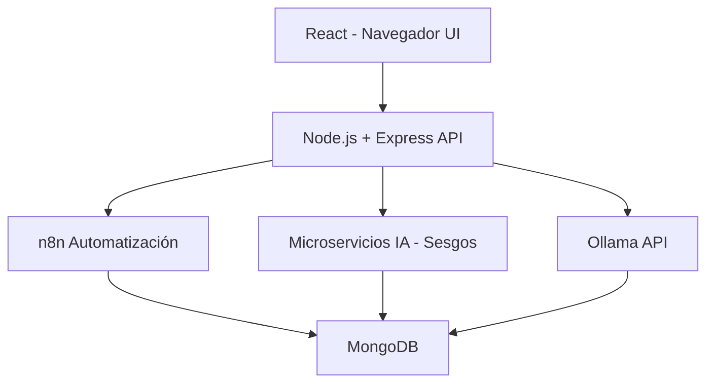

<p align="center">
  
  
  
  
  
  
  
  
</p>

# 📚 Tutor Virtual de Lectura Crítica  

## 📖 Descripción del Proyecto  
**Tutor Virtual de Lectura Crítica** es una aplicación web desarrollada con el stack **MERN** que busca fortalecer las habilidades de **pensamiento crítico** en los usuarios.  

A través de la lectura de textos, el sistema genera **preguntas automáticas**, detecta **sesgos o falacias lógicas** y evalúa la comprensión del contenido. Además, integra **automatización con n8n** para programar sesiones de estudio, enviar recordatorios y registrar el progreso de los usuarios.  

Este proyecto forma parte del curso **Taller de Proyectos 2 – Ingeniería de Sistemas e Informática** de la **Universidad Continental**, bajo la dirección del docente:  
👨‍🏫 *Ing. Gamarra Moreno Daniel*  

---

## 👥 Integrantes del Equipo
- Huaccho Mancilla Steven José  
- Lazo Maravi Nilton Joel  
- Poma Goche Abigail Karim  
- Ramirez Basualdo Lenin Sebasthian  
- Robles Sanchez Britney Sheyla  
- Rojas Mellado Andrea Mirella  

---

## 🎯 Objetivos del Proyecto
- Desarrollar una aplicación web educativa que apoye la **lectura crítica** y el **análisis reflexivo**.  
- Integrar **inteligencia artificial (IA)** para mejorar la experiencia de aprendizaje.  
- Automatizar flujos de estudio mediante **n8n**.  
- Aplicar **buenas prácticas de ingeniería de software** y metodologías ágiles.  
- Promover la **sostenibilidad digital** reduciendo el uso de papel y optimizando recursos.  

---

## 🛠️ Stack Tecnológico  

<p align="center">
  
</p>

- **Frontend:** React.js con diseño responsive y gestión de estado.  
- **Backend:** Node.js + Express.js.  
- **Base de Datos:** MongoDB (Atlas o local).  
- **IA:** Generación de preguntas y detección de sesgos con NLP.  
- **Automatización:** n8n para programar sesiones, enviar notificaciones y registrar avances.  
- **Contenerización:** Docker para levantar servicios.  

---

## 🏗️ Arquitectura del Sistema  


---

## ⚙️ Instrucciones de Instalación  

1. **Instalar Docker**  
   - Seguir la guía en video: [Cómo instalar Docker](https://www.youtube.com/watch?v=wMioaU5yk_w).  

2. **Clonar el repositorio**  
   ```bash
   git clone https://github.com/Nilton-Lazo/proyecto-mern-ia.git
   cd proyecto-mern-ia
   
3. **Levantar los servicios con Docker Compose**
   ```bash
   docker-compose up --build

4. **Acceder al sistema**
   - Una vez completados los pasos, navegar a: [Sistema local](http://localhost:5173/).
     
---

## 📌 Historias de Usuario (Épicas)
- Como **estudiante**, quiero que el tutor virtual me haga preguntas sobre el texto leído para mejorar mi análisis crítico.  
- Como **docente**, quiero asignar textos con actividades automáticas para evaluar el progreso.  
- Como **usuario**, quiero que el sistema detecte sesgos o falacias en los artículos que leo.  
- Como **sistema**, quiero automatizar el envío de textos y actividades para fomentar hábitos de lectura.  
- Como **administrador**, quiero ver un panel con el nivel de comprensión promedio de los usuarios.  

---

## 🤖 Funcionalidades Clave
✅ Generación automática de preguntas críticas.  
✅ Detección de sesgos y falacias en los textos.  
✅ Automatización de recordatorios y asignaciones con n8n.  
✅ Panel de administración con métricas de comprensión.  
✅ Seguridad con autenticación y gestión de usuarios.  

---

## ✅ Pruebas Automatizadas
- **Unitarias:** Jest (backend y frontend).  
- **E2E:** Cypress o Playwright.  
- **Cobertura mínima:** 70% (objetivo >90%).  

---

## 📊 Metodología de Trabajo
- **Metodología Ágil:** Scrum/Kanban con sprints semanales.  
- **Tablero de gestión de tareas:** GitHub Projects / Trello.  
- **Control de versiones:** Uso de Git Flow para gestión de ramas y commits descriptivos.  

---

## 🌱 Impacto Ambiental
🌍 El proyecto promueve la **educación digital** evitando el uso de papel y fomentando el aprendizaje sostenible.  
⚡ El uso de **Docker** permite reducir hasta un 30% el consumo energético frente a entornos locales tradicionales.  

---

## 📂 Documentación
📄 `README.md` con información del proyecto y del equipo.  
📊 Diagramas de arquitectura (UML, flujo de datos, contenedores).  
📝 Informe técnico final con decisiones de diseño, IA, automatización e impacto ambiental.  

---

## 📽️ Demostración
Se incluirá un video demostrativo mostrando:  
🎥 Funcionalidades principales.  
🔄 Flujo de usuario.  
🤖 Integración de IA y n8n.  

---

## 📜 Licencia
Este proyecto es de uso académico para el curso **Taller de Proyectos 2** – **Universidad Continental** (2025).  
