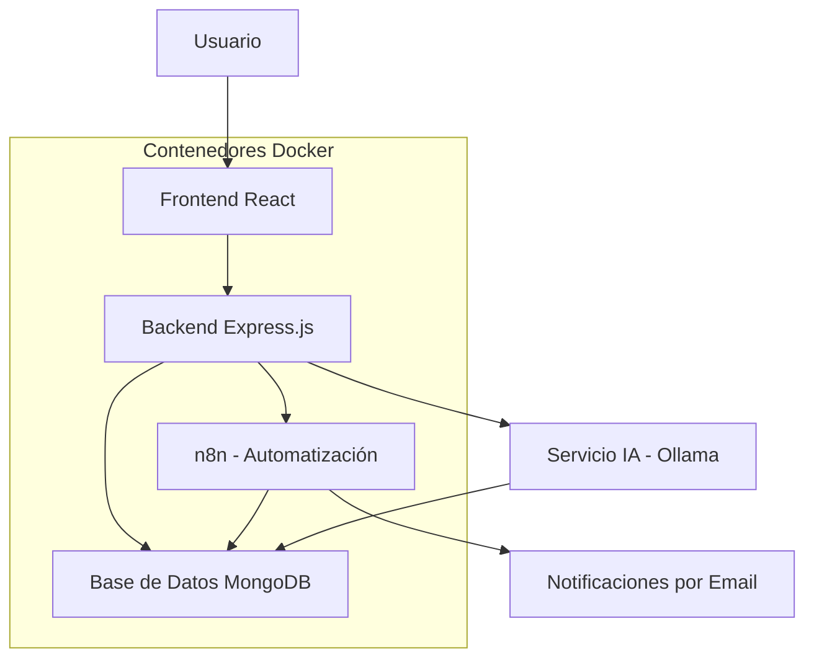
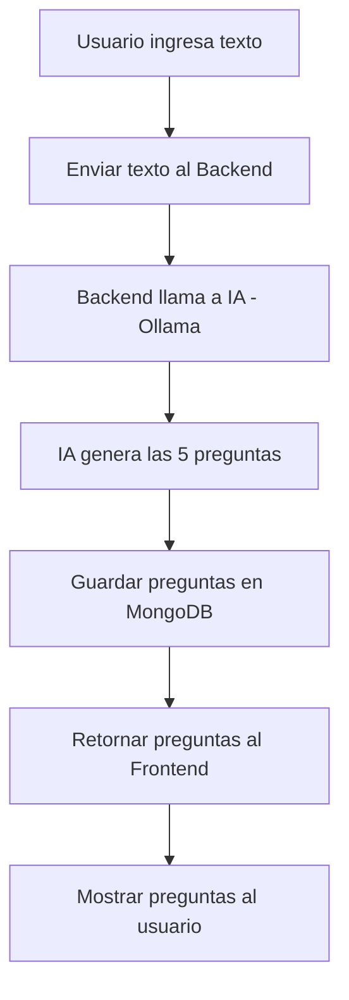
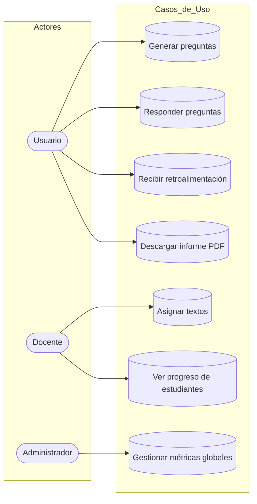
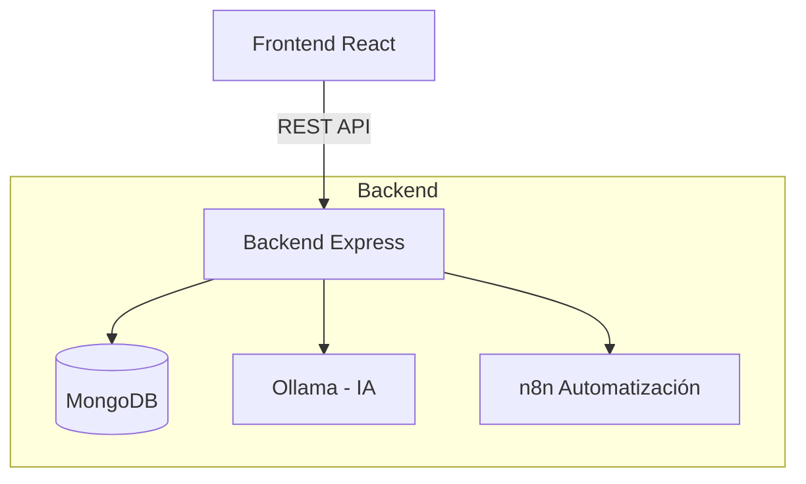
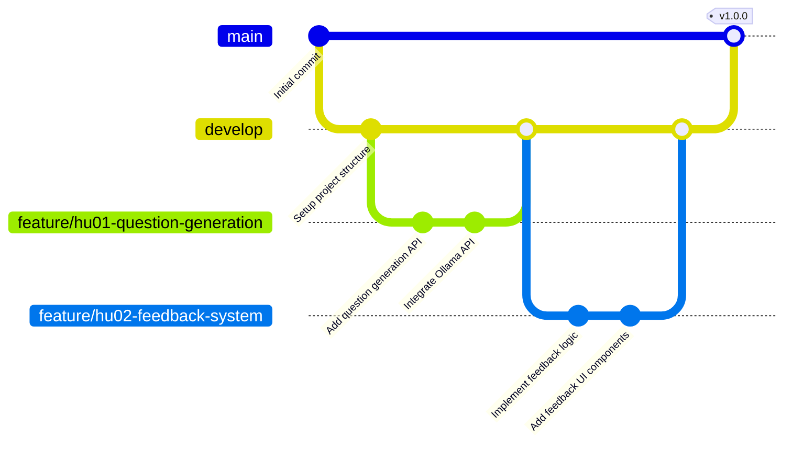

<p align="center">
  
  
  
  
  
  
  
  
</p>

# 📚 Tutor Virtual de Lectura Crítica  

## 📖 Descripción del Proyecto  
**Tutor Virtual de Lectura Crítica** es una aplicación web desarrollada con el stack **MERN** que busca fortalecer las habilidades de **pensamiento crítico** en los usuarios.  

A través de la lectura de textos, el sistema genera **preguntas automáticas**, detecta **sesgos o falacias lógicas** y evalúa la comprensión del contenido. Además, integra **automatización con n8n** para programar sesiones de estudio, enviar recordatorios y registrar el progreso de los usuarios.  

Este proyecto forma parte del curso **Taller de Proyectos 2 – Ingeniería de Sistemas e Informática** del **Colegio San Carlos**, bajo la dirección del docente:  
👨‍🏫 *Ing. Gamarra Moreno Daniel*  

---

## 👥 Integrantes del Equipo
- Huaccho Mancilla Steven José  
- Lazo Maravi Nilton Joel  
- Poma Goche Abigail Karim  
- Ramirez Basualdo Lenin Sebasthian  
- Robles Sanchez Britney Sheyla  
- Rojas Mellado Andrea Mirella  

---

## 🎯 Objetivos del Proyecto
- Desarrollar una aplicación web educativa que apoye la **lectura crítica** y el **análisis reflexivo**.  
- Integrar **inteligencia artificial (IA)** para mejorar la experiencia de aprendizaje.  
- Automatizar flujos de estudio mediante **n8n**.  
- Aplicar **buenas prácticas de ingeniería de software** y metodologías ágiles.  
- Promover la **sostenibilidad digital** reduciendo el uso de papel y optimizando recursos.  

---

## 🛠️ Stack Tecnológico  

<p align="center">
  
</p>

- **Frontend:** React.js con diseño responsive y gestión de estado.  
- **Backend:** Node.js + Express.js.  
- **Base de Datos:** MongoDB (Atlas o local).  
- **IA:** Generación de preguntas y detección de sesgos con NLP.  
- **Automatización:** n8n para programar sesiones, enviar notificaciones y registrar avances.  
- **Contenerización:** Docker para levantar servicios.  

---

## 🏗️ Arquitectura del Sistema  


```mermaid 
flowchart TD
    A[Usuario] --> B[Frontend React]
    B --> C[Backend Express.js]
    C --> D[Base de Datos MongoDB]
    C --> E[Servicio IA - Ollama]
    C --> F[n8n - Automatización]
    F --> G[Notificaciones por Email]
    F --> D
    E --> D
    
    subgraph "Contenedores Docker"
        B
        C
        D
        F
    end
```

```mermaid 
flowchart TD
    A[Usuario ingresa texto] --> B[Enviar texto al Backend]
    B --> C[Backend llama a IA - Ollama]
    C --> D[IA genera las 5 preguntas]
    D --> E[Guardar preguntas en MongoDB]
    E --> F[Retornar preguntas al Frontend]
    F --> G[Mostrar preguntas al usuario]
```

```mermaid
flowchart LR
    subgraph Actores
        A1([Usuario])
        A2([Docente])
        A3([Administrador])
    end

    subgraph Casos_de_Uso
        U1[(Generar preguntas)]
        U2[(Responder preguntas)]
        U3[(Recibir retroalimentación)]
        U4[(Descargar informe PDF)]
        D1[(Asignar textos)]
        D2[(Ver progreso de estudiantes)]
        AD1[(Gestionar métricas globales)]
    end

    A1 --> U1
    A1 --> U2
    A1 --> U3
    A1 --> U4

    A2 --> D1
    A2 --> D2

    A3 --> AD1
```

```mermaid 
graph TD
    A[Frontend React] -->|REST API| B[Backend Express]
    B --> C[(MongoDB)]
    B --> D[Ollama - IA]
    B --> E[n8n Automatización]

    subgraph Backend
        B
        C
        D
        E
    end
```
---

## 🏗️ Metodología de Desarrollo 


```mermaid 
gitGraph
    commit id: "Initial commit"
    branch develop
    checkout develop
    commit id: "Setup project structure"
    branch feature/hu01-question-generation
    checkout feature/hu01-question-generation
    commit id: "Add question generation API"
    commit id: "Integrate Ollama API"
    checkout develop
    merge feature/hu01-question-generation
    branch feature/hu02-feedback-system
    commit id: "Implement feedback logic"
    commit id: "Add feedback UI components"
    checkout develop
    merge feature/hu02-feedback-system
    checkout main
    merge develop tag: "v1.0.0"
```
---

## 📂 Estructura del Proyecto

A continuación se presenta la estructura general del proyecto **MERN + IA + n8n**, organizada por carpetas y módulos principales.

```bash
tutor-virtual-lectura-critica/
├── frontend/                     # Aplicación React (Vite)
│   ├── src/
│   │   ├── components/           # Componentes reutilizables
│   │   ├── pages/                # Vistas principales (Home, Lectura, Reportes)
│   │   ├── hooks/                # Hooks personalizados
│   │   ├── services/             # Peticiones API hacia el backend
│   │   ├── context/              # Contexto global (auth, sesiones)
│   │   ├── styles/               # Estilos globales / Tailwind
│   │   └── main.jsx
│   ├── public/
│   ├── package.json
│   └── vite.config.js

├── backend/                      # API con Node.js + Express
│   ├── src/
│   │   ├── controllers/          # Lógica de cada endpoint
│   │   ├── routes/               # /api/ia (preguntas, feedback, reportes, etc.)
│   │   ├── models/               # Modelos de MongoDB (Text, Questions, Reports)
│   │   ├── services/             # Servicios IA (Ollama, sesgos, PDF)
│   │   ├── middleware/           # Autenticación, logs, validaciones
│   │   └── utils/                # Helpers, manejo de errores
│   ├── tests/                    # Pruebas con Jest
│   ├── package.json
│   └── server.js                 # Punto de inicio del backend

├── src/n8n-automation/           # Workflows n8n (sin Docker)
│   ├── workflows/                # JSON exportables
│   ├── docs/                     # N8N_SETUP.md, WORKFLOWS.md
│   └── examples/                 # Payloads de prueba

├── docker-compose.yml            # Orquestación de contenedores
├── .env.example                  # Variables de entorno modelo
├── README.md
└── docs/                         # Documentación adicional
    ├── arquitectura.png
    ├── uml/
    └── informe-final.pdf

---

## 🔀 Git Flow del Proyecto

Para garantizar orden, control de versiones y trabajo colaborativo, el proyecto utiliza la estrategia **Git Flow**.  
Este flujo permite desarrollar nuevas funciones sin afectar la rama principal y mantener un historial limpio.

### 🌲 Estructura de ramas

El proyecto utiliza las siguientes ramas principales:

| Rama | Función |
|------|---------|
| **main** | Versión estable lista para producción. |
| **develop** | Integración de nuevas funcionalidades antes de pasar a main. |
| **feature/** | Desarrollo de nuevas funcionalidades (una rama por HU). |
| **hotfix/** | Correcciones urgentes en producción. |
| **release/** | Preparación de versiones finales. |

### 🧩 Convención de ramas "feature/HU"

Para cada Historia de Usuario (HU), se crea una rama:
feature/hu01-generar-preguntas
feature/hu02-feedback
feature/hu05-reportes
feature/hu06-informe-pdf

## 🛠 Comandos del Flujo de Trabajo

### 1️⃣ Crear una nueva HU
```bash
git checkout develop
git pull
git checkout -b feature/hu01-generar-preguntas
```
---


## 🧠 Ejemplos de Uso de la API (Backend)

A continuación se muestran ejemplos reales para interactuar con el **backend del Tutor Virtual**.  
Todas las rutas están disponibles en `http://localhost:3000/api/ia`.

### 1. Generar preguntas (HU01)
Genera 5 preguntas de comprensión lectora a partir de un texto.

**Ruta:** `POST /api/ia/questions`  
**Ejemplo:**
```bash
curl -X POST http://localhost:3000/api/ia/questions \
  -H "Content-Type: application/json" \
  -d '{"text": "La contaminación ambiental afecta la salud y el equilibrio ecológico."}'
Respuesta esperada:

json
Copiar código
{
  "message": "Texto y preguntas guardados en Mongo correctamente",
  "data": {
    "questions": [
      "¿Qué consecuencias tiene la contaminación ambiental?",
      "¿Cómo afecta la contaminación al equilibrio ecológico?",
      "¿Qué relación existe entre contaminación y salud?",
      "¿Por qué es importante reducir la contaminación?",
      "¿Qué acciones se pueden tomar para mitigarla?"
    ]
  }
}
```
### 2. Obtener retroalimentación (HU02)
Analiza una respuesta y devuelve una retroalimentación corta.

Ruta: POST /api/ia/feedback
Ejemplo:

Copiar código
```bash
curl -X POST http://localhost:3000/api/ia/feedback \
  -H "Content-Type: application/json" \
  -d '{
    "text": "La contaminación ambiental afecta la salud y el equilibrio ecológico.",
    "question": "¿Qué consecuencias tiene la contaminación ambiental?",
    "answer": "Provoca enfermedades respiratorias y daña los ecosistemas."
  }'
Respuesta esperada:

json
Copiar código
{
  "feedback": "Correcta, mencionas efectos reales pero podrías profundizar en el daño ecológico.",
  "saved": { ... }
}
```
### 3. Generar reporte general (HU05)
Devuelve un resumen estadístico de todas las respuestas.

Ruta: GET /api/ia/reports
Ejemplo:

Copiar código
```bash
curl http://localhost:3000/api/ia/reports
Respuesta esperada:

json
Copiar código
{
  "total": 12,
  "correctas": 7,
  "incorrectas": 3,
  "parciales": 2,
  "ultimas": [ ... ]
}
```
### 4. Generar informe PDF (HU06)
Descarga un informe con las respuestas y retroalimentaciones.

Ruta: GET /api/ia/informe
Ejemplo:

Copiar código
```bash
curl -o informe.pdf http://localhost:3000/api/ia/informe
📄 El archivo informe.pdf se descarga automáticamente con el resumen de resultados.
```
### 5. Chat con IA
Ruta: POST /api/ia/chat
Ejemplo:

```bash
Copiar código
curl -X POST http://localhost:3000/api/ia/chat \
  -H "Content-Type: application/json" \
  -d '{"prompt": "Explica brevemente qué es el pensamiento crítico."}'
Respuesta esperada:

json
Copiar código
{
  "ok": true,
  "answer": "El pensamiento crítico consiste en analizar, cuestionar y evaluar la información antes de aceptarla."
}
```
### 🧪 Ejecución de Pruebas Automatizadas

Documentación completa: **[tests/README.md](tests/README.md)**

| Tipo | Comando | Reporte HTML coverage |
|------|---------|----------------------|
| Unitarias backend | `pnpm test:unit:backend` | `coverage/unit-backend/lcov-report/index.html` |
| Unitarias frontend | `pnpm test:unit:frontend` | `coverage/unit-frontend/lcov-report/index.html` |
| Integración API (Supertest) | `pnpm test:integration:api` | `coverage/integration-api/lcov-report/index.html` |
| Integración frontend | `pnpm test:integration:frontend` | `coverage/integration-frontend/lcov-report/index.html` |
| **Todas Jest** | `pnpm test` | (genera las 4 carpetas) |
| E2E / Aceptación (Cypress) | `pnpm test:e2e` | — |
| Postman / Newman | `pnpm test:postman` | — |
| **Pipeline completo** | `pnpm test:all` | — |

Abrir coverage en macOS: `pnpm coverage:open:unit-backend` (etc.)

Meta: ≥70% cobertura (objetivo >90%).

### 💡 Notas Técnicas
Todos los endpoints se encuentran en src/backend/routes/ia.js.

El modelo usado por defecto es llama3:8b, configurable desde el archivo .env con:

env
Copiar código
```bash
OLLAMA_MODEL=llama3:8b
OLLAMA_HOST=http://<tu_ip_local>:11434
La base de datos se ejecuta en MongoDB (local o Atlas).
```
El servicio de pruebas usa mocks definidos en `tests/support/jest.setup.js`.

---

## ⚙️ Instrucciones de Instalación  

### Opción A — Docker (backend + frontend)

MongoDB corre **aparte** (local en `:27017`, como ya lo haces).

```bash
git clone https://github.com/Nilton-Lazo/proyecto-mern-ia.git
cd proyecto-mern-ia
cp docker/.env.example .env    # opcional
docker compose up -d --build
```

- Frontend: http://localhost:5173  
- Backend: http://localhost:3000  
- MongoDB: `mongodb://127.0.0.1:27017/tutor-lectura` (en el host)

### Opción B — Desarrollo local

```bash
pnpm install
pnpm dev:backend    # :3000
pnpm dev:frontend   # :5173
```
     
---

## 📌 Historias de Usuario (Épicas)
- Como **estudiante**, quiero que el tutor virtual me haga preguntas sobre el texto leído para mejorar mi análisis crítico.  
- Como **docente**, quiero asignar textos con actividades automáticas para evaluar el progreso.  
- Como **usuario**, quiero que el sistema detecte sesgos o falacias en los artículos que leo.  
- Como **sistema**, quiero automatizar el envío de textos y actividades para fomentar hábitos de lectura.  
- Como **administrador**, quiero ver un panel con el nivel de comprensión promedio de los usuarios.  

---

## 🤖 Funcionalidades Clave
✅ Generación automática de preguntas críticas.  
✅ Detección de sesgos y falacias en los textos.  
✅ Automatización de recordatorios y asignaciones con n8n.  
✅ Panel de administración con métricas de comprensión.  
✅ Seguridad con autenticación y gestión de usuarios.  

---

### Pruebas E2E (Cypress)

Requisitos: **MongoDB en :27017** + backend + frontend.

```bash
pnpm seed:e2e          # usuarios de prueba
pnpm test:e2e          # verifica servicios y corre Cypress
pnpm cy:open           # modo interactivo
```

Credenciales: `cypress.env.json` — docente `luis@gmail.com` / estudiante `joel@gmail.com` (pass: `prueba`).

---

## ✅ Pruebas Automatizadas

| Tipo | Herramienta | Carpeta |
|------|-------------|---------|
| Unitarias frontend | Jest + React Testing Library | `tests/unit/frontend/` |
| Unitarias backend | Jest | `tests/unit/backend/` |
| Integración API | Supertest | `tests/integration/api/` |
| Integración frontend | RTL + mock API | `tests/integration/frontend/` |
| Aceptación / E2E | Cypress | `cypress/e2e/` |
| Contrato API | Postman + Newman | `tests/postman/` |

Ver **[tests/README.md](tests/README.md)** para comandos y rutas de coverage HTML.

---

## 📊 Metodología de Trabajo
- **Metodología Ágil:** Scrum/Kanban con sprints semanales.  
- **Tablero de gestión de tareas:** GitHub Projects / Trello.  
- **Control de versiones:** Uso de Git Flow para gestión de ramas y commits descriptivos.  

---

## 🌱 Impacto Ambiental
🌍 El proyecto promueve la **educación digital** evitando el uso de papel y fomentando el aprendizaje sostenible.  
⚡ El uso de **Docker** permite reducir hasta un 30% el consumo energético frente a entornos locales tradicionales.  

---

## 📂 Documentación
📄 `README.md` con información del proyecto y del equipo.  
📊 Diagramas de arquitectura (UML, flujo de datos, contenedores).  
📝 Informe técnico final con decisiones de diseño, IA, automatización e impacto ambiental.  

---

## 🎯 Diferenciador educativo de la plataforma

Esta plataforma no reemplaza al docente ni funciona como un chat genérico. A diferencia de usar ChatGPT directamente, el sistema organiza las lecturas por **áreas curriculares**, asigna actividades a estudiantes específicos, guarda el **progreso individual**, genera preguntas clasificadas por **habilidad lectora**, brinda **retroalimentación formativa** y permite **trazabilidad académica** mediante reportes. Esto convierte la IA en una herramienta de acompañamiento pedagógico, no solo en un generador de respuestas.

- El docente controla qué lectura se asigna (texto, Markdown o PDF).
- El estudiante trabaja dentro de una **ruta guiada**: lectura → análisis IA → preguntas → respuestas → retroalimentación.
- El avance se **guarda automáticamente** (autosave cada ~8 s y al salir de la actividad).
- La retroalimentación queda registrada como evidencia de aprendizaje.
- El progreso se mide por habilidades en el **Mapa de mejora lectora** (literal, inferencial, crítico, vocabulario, idea principal).
- El docente puede revisar avances por estudiante, área y estado.

## 📊 Módulo de reportes con IA

A diferencia de un chat genérico, los reportes de esta plataforma convierten las interacciones con IA en **evidencia académica organizada**, permitiendo identificar avances, dificultades y recomendaciones por estudiante, área y habilidad lectora.

### Diferencia por rol

| Rol | Ruta | Enfoque |
|-----|------|---------|
| **Estudiante** | `/student/reports` | ¿Cómo avanzo? ¿Qué habilidades debo mejorar? ¿Qué me recomienda la IA? |
| **Docente** | `/teacher/reports` | ¿Cómo va el grupo? ¿Quién requiere acompañamiento? ¿Qué temas tienen bajo desempeño? |

La ruta `/reports` redirige automáticamente según el rol del usuario autenticado.

### Mapa de habilidades lectoras

Se calcula a partir de las respuestas evaluadas en cada `Submission` entregada:

- **Comprensión literal**, **inferencial**, **pensamiento crítico**, **vocabulario**, **idea principal**
- Cada respuesta se puntúa: correcta = 100, parcial = 55, incorrecta = 15
- Se promedian los puntajes por habilidad y se asigna nivel: Bajo / En proceso / Logrado / Destacado
- Las recomendaciones se generan automáticamente según el nivel de cada habilidad

### Indicadores calculados

- Actividades asignadas, completadas, en progreso y vencidas
- Progreso y comprensión promedio
- Desempeño por área curricular y tema
- Evolución temporal del avance
- Retroalimentación reciente de IA con trazabilidad
- Alertas pedagógicas y recomendaciones (docente)

### Exportación

- **Estudiante:** `GET /api/student/reports/export-pdf` — resumen, habilidades, actividades y recomendaciones
- **Docente:** `GET /api/teacher/reports/export-pdf` y `GET /api/teacher/reports/export-csv`

Todos los endpoints de reportes requieren **JWT** y validan el rol. Los datos provienen del modelo `Submission` (flujo pedagógico principal), no de práctica libre.

### Endpoints de reportes — estudiante

- `GET /api/student/reports/summary`
- `GET /api/student/reports/skills`
- `GET /api/student/reports/areas`
- `GET /api/student/reports/timeline`
- `GET /api/student/reports/recent-feedback`
- `GET /api/student/reports/recommendations`
- `GET /api/student/reports/export-pdf`

### Endpoints de reportes — docente

- `GET /api/teacher/reports/summary`
- `GET /api/teacher/reports/skills`
- `GET /api/teacher/reports/students`
- `GET /api/teacher/reports/areas`
- `GET /api/teacher/reports/activities-difficulty`
- `GET /api/teacher/reports/recent-answers`
- `GET /api/teacher/reports/alerts`
- `GET /api/teacher/reports/recommendations`
- `GET /api/teacher/reports/export-pdf`
- `GET /api/teacher/reports/export-csv`

### Áreas curriculares soportadas
Comunicación, Matemática, Ciencia y Tecnología, Personal Social, Arte y Cultura, Inglés, Educación Religiosa, Tutoría, Otro.

---

## ⚡ Automatización con n8n

n8n funciona como **capa de automatización externa** conectada al backend mediante webhooks y endpoints internos. No reemplaza la lógica principal ni vive en el frontend.

### Ubicación
- Workflows: `src/n8n-automation/workflows/`
- Documentación: `src/n8n-automation/docs/N8N_SETUP.md`
- Payloads de ejemplo: `src/n8n-automation/examples/webhook-payloads.json`

### Instalar n8n (sin Docker)

```bash
npm install -g n8n
n8n start
# Panel: http://localhost:5678
```

Alternativa: `npx n8n`

### Workflows incluidos

| Workflow | Propósito |
|----------|-----------|
| `reading-reminder-workflow.json` | Recordatorios de lectura (cron diario) |
| `activity-assigned-notification.json` | Notificar actividad asignada (webhook) |
| `weekly-teacher-report.json` | Resumen semanal docente (cron lunes) |
| `generate-questions-backend.json` | Generación de preguntas vía IA (webhook) |
| `detect-biases-backend.json` | Detección de sesgos (webhook) |

### Variables de entorno (backend)

```env
N8N_BASE_URL=http://localhost:5678
N8N_INTERNAL_API_KEY=tu_clave_secreta
N8N_GENERATE_QUESTIONS_WEBHOOK_URL=http://localhost:5678/webhook/generate-questions
N8N_DETECT_BIASES_WEBHOOK_URL=http://localhost:5678/webhook/detect-biases
N8N_ACTIVITY_ASSIGNED_WEBHOOK_URL=http://localhost:5678/webhook/activity-assigned
```

Ver `src/backend/.env.example` para la lista completa.

### Endpoints de automatización

Base: `/api/automation` — requieren header `x-n8n-api-key`

| Método | Ruta | Descripción |
|--------|------|-------------|
| GET | `/pending-activities` | Actividades pendientes / por vencer |
| POST | `/workflow-log` | Registrar ejecución de workflow |
| GET | `/teacher-weekly-summary` | Resumen semanal para docentes |
| POST | `/test-webhook` | Verificar configuración |

### Probar conexión

```bash
curl -X POST http://localhost:3000/api/automation/test-webhook \
  -H "x-n8n-api-key: tu_clave_secreta"
```

### Principio de diseño

Si n8n no está configurado o falla, el backend **sigue funcionando** con Ollama directo. Los logs en `WorkflowLog` evidencian las automatizaciones para evaluación académica (ICACIT).

---

## 🎓 Flujo del estudiante con IA

### Dashboard (`/student/home`)
Resumen personalizado: actividades pendientes, progreso promedio, acceso rápido a continuar una lectura o practicar con IA.

### Mis actividades vs Práctica con IA
| Sección | Ruta | Propósito |
|---------|------|-----------|
| **Mis actividades** | `/student/activities` | Lecturas asignadas por el docente. Generación de preguntas IA ligada a cada actividad, borrador, envío y retroalimentación. |
| **Práctica con IA** | `/student/practice` | Práctica libre: el estudiante pega cualquier texto, sin depender del docente. |
| **Progreso** | `/student/progress` | Vista resumida del avance en actividades asignadas. |
| **Reportes** | `/student/reports` | Analítica educativa personal: habilidades, áreas, evidencia IA y PDF. |

### Endpoints docente
- `GET /api/teacher/students?search=` — lista estudiantes con búsqueda
- `POST /api/teacher/extract-pdf` — extrae texto de PDF (máx. 5 MB)
- `POST /api/teacher/activities` — crea actividad con área, tema y asignados

### Endpoints estudiante
- `GET /api/student/activities?area=&status=&search=` — lista agrupable por área
- `GET /api/student/activities/:id` — detalle con borrador, preguntas y análisis IA
- `POST /api/student/activities/:id/analyze` — análisis de lectura con IA
- `POST /api/student/activities/:id/generate-questions` — genera preguntas tipadas por habilidad
- `POST /api/student/activities/:id/save-draft` — guarda borrador manual
- `POST /api/student/activities/:id/autosave` — guardado automático de progreso
- `POST /api/student/activities/:id/submit` — evalúa con IA, calcula skillScores y marca entregada
- `GET /api/student/progress` — resumen de progreso
- `GET /api/student/progress/skills` — mapa de mejora lectora agregado
- `POST /api/ai/practice` — práctica libre (análisis + preguntas)

### Variables IA
`OLLAMA_HOST`, `OLLAMA_MODEL` en `src/backend/.env`

---

## 🧭 Guía de Usuario

Esta guía explica el uso básico del sistema **Tutor Virtual de Lectura Crítica**.

### ✔ 1. Registro e Inicio de Sesión
1. Ingrese su correo electrónico.
2. Cree una contraseña segura.
3. Acceda al sistema para visualizar el panel principal.

### ✔ 2. Crear una Sesión de Lectura
1. Ir a la sección **“Nuevo Texto”**.
2. Pegar o escribir el texto que desea analizar.
3. Hacer clic en **“Generar Preguntas”**.
4. El sistema generará automáticamente 5 preguntas críticas.

### ✔ 3. Responder Preguntas
1. Seleccionar una pregunta del listado.
2. Escribir la respuesta en el cuadro correspondiente.
3. El sistema mostrará retroalimentación en tiempo real basada en IA.

### ✔ 4. Ver Historial y Reportes
- En la sección **“Reportes”**, podrá visualizar:
  - Respuestas correctas, incorrectas y parciales.
  - Últimas actividades registradas.
  - Historial de sesiones.

### ✔ 5. Descargar Informe PDF
1. Ir a **“Reportes”** → “Generar PDF”.
2. Descargar informe con:
   - Preguntas
   - Respuestas
   - Retroalimentación
   - Métricas de rendimiento

---

## 📽️ Demostración
Se incluirá un video demostrativo mostrando:  
🎥 Funcionalidades principales.  
🔄 Flujo de usuario.  
🤖 Integración de IA y n8n.  

---

## 📜 Licencia
Este proyecto es de uso académico para el curso **Taller de Proyectos 2** – **Colegio San Carlos** (2025).  

---

