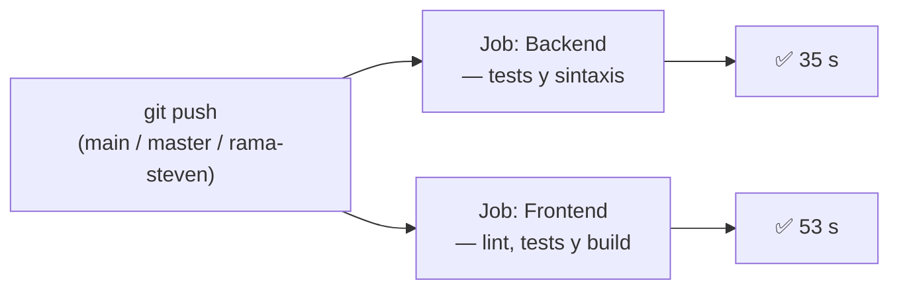
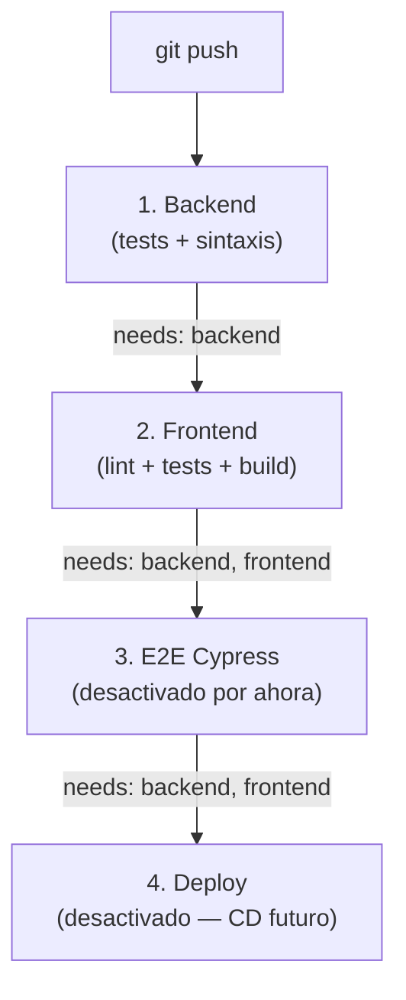

<p align="center">
  
  
  
  
</p>

# CI — Integración Continua con GitHub Actions

<p align="center">
  <strong>Tutor Virtual de Lectura Comprensiva Escolar</strong><br/>
  <em>Explicación de lo que ves en GitHub Actions y cómo funciona el pipeline</em>
</p>

---

## ¿Qué es lo que estamos viendo?

Cuando haces **push** a GitHub (por ejemplo a la rama `rama-steven`), GitHub ejecuta automáticamente un archivo llamado **workflow** ubicado en:

```
.github/workflows/ci.yml
```

Ese archivo es una **receta automatizada**: le dice a GitHub qué comandos correr para comprobar que el proyecto no se rompió con tus cambios.

En la pantalla de GitHub Actions ves algo como esto:

| Elemento en pantalla | Qué significa |
|----------------------|---------------|
| **ci.yml** | Nombre del archivo de configuración del pipeline |
| **Triggered via push** | Se activó porque alguien subió código (`git push`) |
| **SteveMancilla → rama-steven** | Usuario y rama que dispararon el pipeline |
| **Backend — tests y sintaxis** ✅ | Job 1 terminó bien (35 s en tu captura) |
| **Frontend — lint, tests y build** ✅ | Job 2 terminó bien (53 s en tu captura) |
| **Check verde** | Todo pasó; el código cumple las validaciones de CI |

**CI** significa *Continuous Integration* (Integración Continua): cada cambio se valida automáticamente antes de confiar en él.

---

## ¿Por qué lo hicimos?

Antes, para saber si el proyecto funcionaba había que correr manualmente:

```bash
pnpm test:unit:backend
pnpm test:unit:frontend
pnpm build:frontend
# ... etc.
```

Ahora GitHub lo hace **solo** al hacer push o al abrir un Pull Request. Si algo falla, lo ves en rojo ❌ y sabes qué parte se rompió (backend o frontend).

**Beneficios para el equipo:**

- Detecta errores antes de mergear a `main`
- No depende de que alguien recuerde correr los tests
- Deja evidencia de calidad (útil para ICACIT y evaluación del proyecto)
- Genera reportes de cobertura descargables

---

## Estructura del pipeline actual

El workflow se llama **CI - Tutor Virtual MERN IA** y tiene **2 jobs activos** que corren **en paralelo** (al mismo tiempo):



### Job 1 — Backend (tests y sintaxis)

| Paso | Qué hace |
|------|----------|
| Checkout | Descarga el código del repositorio |
| Setup pnpm + Node 20 | Prepara el entorno (igual que en tu máquina) |
| `pnpm install --frozen-lockfile` | Instala dependencias del workspace |
| `node --check src/backend/index.js` | Verifica que el backend no tenga errores de sintaxis |
| `pnpm test:unit:backend` | Pruebas unitarias del servidor |
| `pnpm test:integration:api` | Pruebas de integración con Supertest |
| Upload artifact | Sube reportes de cobertura |

### Job 2 — Frontend (lint, tests y build)

| Paso | Qué hace |
|------|----------|
| Checkout + pnpm + Node 20 | Igual que backend, en otra máquina virtual |
| `pnpm --filter frontend run lint` | Revisa estilo y errores con ESLint |
| `pnpm test:unit:frontend` | Pruebas unitarias de React |
| `pnpm test:integration:frontend` | Pruebas con MSW (API simulada) |
| `pnpm build:frontend` | Compila TypeScript + Vite (build de producción) |
| Upload artifact | Sube reportes de cobertura |

---

## Modelo 1 — Jobs en PARALELO (lo que usamos ahora)

En el `ci.yml` actual, **backend** y **frontend** **no esperan uno al otro**. GitHub lanza **dos máquinas virtuales** a la vez:

```
         ┌─────────────────────────┐
         │      git push           │
         └───────────┬─────────────┘
                     │
         ┌───────────┴───────────┐
         ▼                       ▼
  ┌──────────────┐        ┌──────────────┐
  │   BACKEND    │        │   FRONTEND   │
  │  (35 seg)    │        │  (53 seg)    │
  └──────────────┘        └──────────────┘
         │                       │
         └───────────┬───────────┘
                     ▼
              Ambos ✅ = CI OK
```

**Cuándo conviene:** cuando las tareas son **independientes**. El frontend no necesita que el backend esté corriendo para hacer `lint` o `build` (usa variables de prueba como `VITE_API_URL=http://localhost:3000/api`).

**Ventaja:** más rápido — el pipeline total dura ~53 s (el job más lento), no 35 + 53 = 88 s.

---

## Modelo 2 — Jobs en SECUENCIA con `needs` (requisito previo)

Hay otra forma: que un job **espere** a que otro termine bien antes de empezar. En GitHub Actions se configura con **`needs:`**.

Ejemplo conceptual:

```yaml
jobs:
  backend:
    # ... corre primero ...

  frontend:
    needs: [backend]    # ← NO empieza hasta que backend termine ✅
    # ... corre después ...

  e2e:
    needs: [backend, frontend]   # ← espera a AMBOS
    # ... Cypress solo si backend y frontend pasaron ...
```

Visualmente:



### ¿Qué pasa si falla un requisito?

```
Backend ❌  →  Frontend NO corre (needs: backend)
Backend ✅  →  Frontend corre
Frontend ❌ →  E2E NO corre (needs: frontend)
Backend ✅ + Frontend ✅  →  E2E puede correr
```

Si el job anterior falla, los que dependen de él se **cancelan o no se ejecutan**. Eso evita perder tiempo en pasos que ya no tienen sentido.

### Comparación directa

| | Paralelo (actual) | Secuencial con `needs` |
|---|-------------------|------------------------|
| **Velocidad** | Más rápido | Más lento (suma tiempos) |
| **Dependencia real** | No hay entre jobs | Sí — B debe pasar antes que C |
| **Uso típico** | Lint, unit tests, build | E2E, deploy, publicar artefactos |
| **En nuestro proyecto** | backend ∥ frontend | e2e y deploy (preparados, comentados) |

---

## Dentro de cada job: pasos en ORDEN (steps)

Aunque los **jobs** corran en paralelo, **dentro de cada job** los **steps** sí van uno tras otro. Si un step falla, los siguientes **no se ejecutan**:

```
Job Frontend:
  1. Checkout          ✅
  2. Install deps      ✅
  3. Lint              ✅
  4. Unit tests        ✅
  5. Integration tests ✅
  6. Build             ✅  ← si falla aquí, no sube artifact
  7. Upload coverage   ✅
```

Eso es distinto de `needs:`:

| Concepto | Nivel | Relación |
|----------|-------|----------|
| **steps** | Dentro de un job | Paso 2 requiere que paso 1 termine |
| **needs** | Entre jobs | Job B requiere que job A termine |

---

## Jobs preparados pero NO activos (futuro)

En el `ci.yml` hay bloques **comentados** con la forma secuencial (`needs`):

### E2E — Cypress

```yaml
# e2e:
#   needs: [backend, frontend]
```

**Por qué está apagado:** Cypress necesita MongoDB, backend en `:3000`, frontend en `:5173` y usuarios de prueba (`pnpm seed:e2e`). Eso no está automatizado en CI todavía.

**Cuándo activarlo:** cuando se configuren servicios en GitHub Actions (MongoDB + levantar servidores + `wait-on`).

### Deploy — CD (Despliegue Continuo)

```yaml
# deploy:
#   needs: [backend, frontend]
#   if: github.ref == 'refs/heads/main'
```

**Por qué está apagado:** no hay plataforma de producción configurada (Vercel, Render, Railway) ni secretos en GitHub.

**Flujo futuro típico:**

```
Backend ✅ → Frontend ✅ → Deploy a producción (solo en main)
```

---

## ¿Cuándo se activa el pipeline?

| Evento | Ramas |
|--------|-------|
| **push** (subes código) | `main`, `master`, `rama-steven` |
| **pull_request** (abres PR) | `main`, `master`, `rama-steven` |

Tu captura muestra un push a **`rama-steven`** por **SteveMancilla** — por eso apareció ese run en Actions.

---

## Variables de entorno en CI (no son las reales)

El pipeline usa **valores de prueba**, no tu `.env` local:

| Variable | Valor en CI | Para qué |
|----------|-------------|----------|
| `JWT_SECRET` | `test_secret` | Tests de auth |
| `MONGODB_URI` | `mongodb://127.0.0.1:27017/tutor_virtual_test` | Tests mockeados |
| `N8N_*` | URLs localhost dummy | No conecta n8n real |
| `VITE_API_URL` | `http://localhost:3000/api` | Build del frontend |

**Importante:** CI no toca tu base de datos real, n8n ni Ollama de producción.

---

## Artefactos (coverage)

Al final de cada run puedes descargar:

| Artifact | Contenido |
|----------|-----------|
| `coverage-backend` | Cobertura unit + integración API |
| `coverage-frontend` | Cobertura unit + integración frontend |

Ruta en GitHub: **Actions → run → Artifacts** (parte inferior de la página).

---

## Cómo leer un error si algo falla

1. Entra a **GitHub → Actions**
2. Abre el run con ❌
3. Mira qué job falló: **Backend** o **Frontend**
4. Expande el step rojo (ej. `Unit tests — backend`)
5. Lee el log — es el mismo error que verías en terminal local

---

## Comandos equivalentes en tu máquina

Lo que GitHub corre por ti, tú puedes correrlo antes del push:

```bash
# Desde la raíz del proyecto
pnpm install --frozen-lockfile

# Backend
node --check src/backend/index.js
pnpm test:unit:backend
pnpm test:integration:api

# Frontend
pnpm --filter frontend run lint
pnpm test:unit:frontend
pnpm test:integration:frontend
VITE_API_URL=http://localhost:3000/api pnpm build:frontend
```

Si todo pasa local, lo más probable es que CI también pase ✅.

---

## Resumen en una frase

**CI** es un robot en GitHub que, cada vez que subes código, ejecuta en paralelo las pruebas del backend y del frontend; si en el futuro activamos E2E o deploy, esos jobs irán **después** usando `needs:` como requisito previo.

---

## Referencias del proyecto

| Archivo | Contenido |
|---------|-----------|
| [`.github/workflows/ci.yml`](../.github/workflows/ci.yml) | Configuración técnica del pipeline |
| [`docs/CI_CD_GUIDE.md`](../docs/CI_CD_GUIDE.md) | Guía detallada para desarrolladores |
| [`tests/README.md`](../tests/README.md) | Documentación de pruebas |
| [`README.md`](../README.md) | Comandos generales del proyecto |
