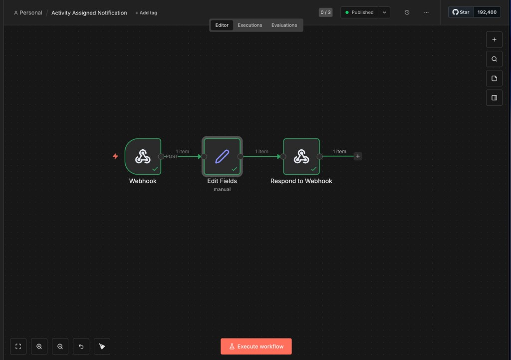
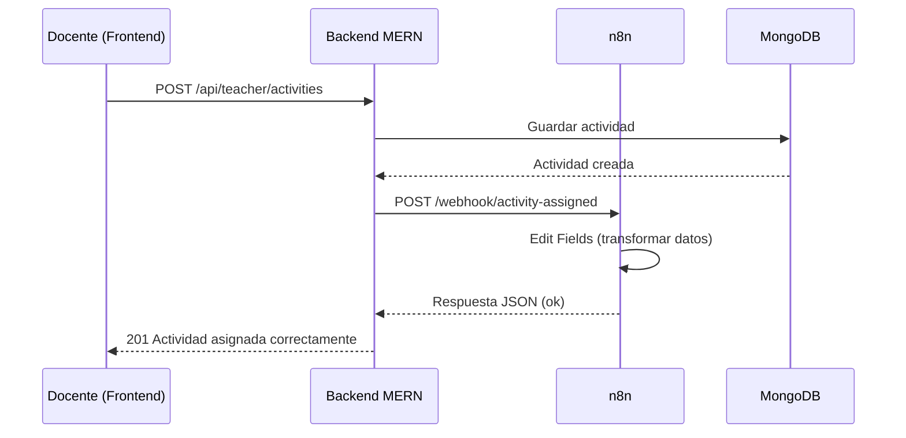

<p align="center">
  
  
  
  
  
  
</p>

<p align="center">
  
  
  
  
  
</p>

# ⚙️ Integración de n8n en el Tutor Virtual de Lectura Comprensiva

<p align="center">
  <strong>Proyecto:</strong> Tutor Virtual de Lectura Crítica — I.E.P. San Carlos<br/>
  <strong>Capa:</strong> Automatización externa vía webhooks &nbsp;·&nbsp; <strong>Última actualización:</strong> Junio 2026
</p>

---

## 🛠️ Stack Tecnológico

<p align="center">
  
</p>

<p align="center">
  
  &nbsp;
  
  &nbsp;
  
  &nbsp;
  
</p>

| Capa | Tecnología | Rol en la integración |
|------|------------|------------------------|
| **Frontend** | React + TypeScript + Tailwind | Docente asigna actividades; estudiante ve notificaciones |
| **Backend** | Node.js + Express | Dispara webhooks hacia n8n al crear actividades |
| **Base de datos** | MongoDB + Mongoose | Persiste actividades, logs y notificaciones |
| **Automatización** | n8n (externo) | Recibe eventos y ejecuta workflows |
| **Comunicación** | Webhooks REST | Backend → n8n → respuesta JSON |

---

## 📑 Índice

| | Sección |
|---|---------|
| 📋 | [1. Resumen de la integración](#-1-resumen-de-la-integración) |
| 🔔 | [2. Flujo implementado en n8n](#-2-flujo-implementado-en-n8n) |
| 🖼️ | [3. Imagen del workflow](#️-3-imagen-del-workflow) |
| 🧩 | [4. Estructura del workflow](#-4-estructura-del-workflow) |
| 📦 | [5. Payload que recibe n8n](#-5-payload-que-recibe-n8n) |
| ⚙️ | [6. Configuración en el backend](#️-6-configuración-en-el-backend) |
| 📁 | [7. Archivos relacionados](#-7-archivos-del-backend-relacionados) |
| 🚀 | [8. Cómo probar desde la interfaz](#-8-cómo-probar-desde-la-interfaz) |
| ✅ | [9. Cómo saber que funciona](#-9-cómo-saber-que-funciona) |
| 🔀 | [10. Integración vs automatización](#-10-diferencia-entre-integración-y-automatización) |
| 💡 | [11. Valor para el proyecto](#-11-valor-para-el-proyecto) |
| 📌 | [12. Próximas mejoras](#-12-próximas-mejoras-propuestas) |
| 🛠️ | [13. Problemas comunes](#️-13-problemas-comunes) |
| 💻 | [14. Comandos útiles](#-14-comandos-útiles) |

---

## Introducción

<p align="left">
  
  
  
</p>

n8n se integró como una **capa externa de automatización** conectada al backend mediante webhooks. Su función principal es recibir eventos académicos del sistema y ejecutar flujos automáticos relacionados con la asignación de actividades.

> **Importante:**  
> n8n **no reemplaza** al backend ni al frontend. Funciona como un servicio externo independiente que recibe eventos desde el backend MERN y permite automatizar tareas posteriores sin modificar el flujo principal de creación de actividades.

---

## 📋 1. Resumen de la integración

<p align="left">
  
  
  
</p>

### Flujo implementado

Actualmente existe **un único flujo real implementado y publicado en n8n**:

| Workflow | Estado | Descripción |
|----------|--------|-------------|
| **Activity Assigned Notification** | Publicado | Se activa cuando el docente asigna una nueva actividad |

### Flujo general del sistema

```
Docente asigna actividad (frontend)
        ↓
Backend guarda la actividad en MongoDB
        ↓
Backend envía evento POST al webhook de n8n
        ↓
n8n recibe el evento (nodo Webhook)
        ↓
n8n ordena y transforma los datos (nodo Edit Fields)
        ↓
n8n responde al backend (nodo Respond to Webhook)
```

> **Nota:**  
> El flujo implementado recibe, ordena y responde el evento de actividad asignada. Esta base queda preparada para ampliarse con notificaciones internas, recordatorios, reportes automáticos y otras acciones posteriores descritas en la sección de [próximas mejoras](#-12-próximas-mejoras-propuestas).

---

## 🔔 2. Flujo implementado en n8n

<p align="left">
  
  
  
</p>

### Activity Assigned Notification

| Propiedad | Valor |
|-----------|-------|
| **Nombre** | Activity Assigned Notification |
| **Estado** | Publicado / Published |
| **Método HTTP** | POST |
| **Ruta del webhook** | `/activity-assigned` |

### URLs del webhook

<p align="left">
  
  
</p>

| Entorno | URL | Uso |
|---------|-----|-----|
| **Producción / publicado** | `http://localhost:5678/webhook/activity-assigned` | Workflow activo y publicado. **URL que debe usar el backend en integración real.** |
| **Pruebas / desarrollo** | `http://localhost:5678/webhook-test/activity-assigned` | Solo durante pruebas manuales con **Listen for test event** en n8n. |

> **Recomendación:**  
> Durante desarrollo puedes usar `/webhook-test/` para pruebas puntuales. Para el flujo publicado y activo, configura el backend con `/webhook/`.

---

## 🖼️ 3. Imagen del workflow

<p align="center">
  
  
  
  
</p>

<p align="center">
  
</p>

<p align="center"><em>Captura del workflow <strong>Activity Assigned Notification</strong> publicado en n8n (Editor).</em></p>

El flujo visual actual está compuesto por **tres nodos**:

1. **Webhook**  
   Recibe el evento enviado desde el backend cuando el docente asigna una actividad. La conexión entrante es de tipo `POST`.

2. **Edit Fields**  
   Ordena y transforma los datos recibidos, extrayendo campos como título, área, tema, docente y estudiantes.

3. **Respond to Webhook**  
   Devuelve una respuesta al backend confirmando que n8n recibió y procesó correctamente el evento.

---

## 🧩 4. Estructura del workflow

| Nodo | Función | Descripción |
|------|---------|-------------|
| **Webhook** | Entrada del evento | Recibe el POST enviado desde el backend MERN |
| **Edit Fields** | Transformación | Organiza los datos de la actividad asignada (título, área, estudiantes, etc.) |
| **Respond to Webhook** | Respuesta | Retorna confirmación al backend indicando que el evento fue procesado |

### Diagrama de secuencia



---

## 📦 5. Payload que recibe n8n

Cuando el docente asigna una actividad, el backend envía un JSON con la siguiente estructura:

```json
{
  "event": "activity_assigned",
  "activityId": "ID_DE_LA_ACTIVIDAD",
  "title": "Otra actividad de prueba",
  "area": "Educación Religiosa",
  "topic": "n8n",
  "dueDate": "2026-06-20",
  "teacherName": "Luis Mateo",
  "students": [
    {
      "id": "ID_DEL_ESTUDIANTE",
      "name": "Joel Lazo Maravi",
      "email": "joel@gmail.com"
    }
  ],
  "timestamp": "2026-06-14T03:18:10.212Z"
}
```

### Descripción de campos

| Campo | Tipo | Descripción |
|-------|------|-------------|
| `event` | `string` | Tipo de evento enviado al workflow. Valor fijo: `activity_assigned` |
| `activityId` | `string` | Identificador único de la actividad asignada en MongoDB |
| `title` | `string` | Título de la actividad |
| `area` | `string` | Área curricular de la actividad |
| `topic` | `string` | Tema de la lectura o actividad |
| `dueDate` | `string \| null` | Fecha límite de entrega (formato `YYYY-MM-DD`) |
| `teacherName` | `string` | Nombre completo del docente que asigna |
| `students` | `array` | Lista de estudiantes asignados con `id`, `name` y `email` |
| `timestamp` | `string` | Fecha y hora ISO del evento |

> **Nota:**  
> Un ejemplo exportable está disponible en `examples/activity-assigned-payload.json`.

---

## ⚙️ 6. Configuración en el backend

El backend utiliza variables de entorno definidas en `src/backend/.env`.

### Variables principales

```env
PORT=3000
BACKEND_BASE_URL=http://localhost:3000
N8N_BASE_URL=http://localhost:5678
N8N_ACTIVITY_ASSIGNED_WEBHOOK_URL=http://localhost:5678/webhook/activity-assigned
N8N_INTERNAL_API_KEY=change_me
N8N_WEBHOOK_TIMEOUT_MS=15000
```

### URL según entorno

| Escenario | Valor de `N8N_ACTIVITY_ASSIGNED_WEBHOOK_URL` |
|-----------|-----------------------------------------------|
| **Pruebas manuales** | `http://localhost:5678/webhook-test/activity-assigned` |
| **Workflow publicado** | `http://localhost:5678/webhook/activity-assigned` |

> **Importante:**  
> Tras modificar el archivo `.env`, reinicia el backend para que dotenv cargue los nuevos valores. Al iniciar, el backend muestra en consola:  
> `N8N_ACTIVITY_ASSIGNED_WEBHOOK_URL: configurada` o `NO configurada`.

### Carga de variables

dotenv se carga al inicio de `src/backend/index.js`, **antes** de importar rutas y servicios:

```javascript
const path = require('path');
require('dotenv').config({ path: path.resolve(__dirname, '.env') });
```

---

## 📁 7. Archivos del backend relacionados

Los siguientes archivos existen en el proyecto y están directamente relacionados con la integración n8n:

### Backend

| Archivo | Función |
|---------|---------|
| `src/backend/services/n8n.service.js` | Envía eventos desde el backend hacia n8n (`triggerActivityAssigned`, pruebas de conexión) |
| `src/backend/routes/automation.routes.js` | Expone rutas de automatización y diagnóstico (`/api/automation/*`) |
| `src/backend/controllers/automation.controller.js` | Controladores HTTP para endpoints de automatización |
| `src/backend/services/automation.service.js` | Lógica de negocio: actividades pendientes, resumen docente, logs |
| `src/backend/middlewares/n8nApiKey.js` | Protege endpoints internos con header `x-n8n-api-key` |
| `src/backend/models/WorkflowLog.js` | Modelo Mongoose para registrar ejecuciones de workflows |
| `src/backend/routes/teacher.js` | Dispara `triggerActivityAssigned()` al crear una actividad |
| `src/backend/index.js` | Monta rutas `/api/automation` y carga dotenv |

### Notificaciones internas (preparado para extensión)

| Archivo | Función |
|---------|---------|
| `src/backend/models/Notification.js` | Modelo de notificaciones in-app para estudiantes |
| `src/backend/services/notification.service.js` | Creación bulk, listado y marcado como leída |
| `src/backend/routes/notifications.routes.js` | `POST /bulk` (n8n), `GET /me`, `PATCH /:id/read` |
| `src/backend/controllers/notifications.controller.js` | Controladores de notificaciones |

### Frontend (notificaciones in-app)

| Archivo | Función |
|---------|---------|
| `src/frontend/src/components/NotificationBell.tsx` | Campana de notificaciones en el header del estudiante |
| `src/frontend/src/services/notificationService.ts` | Cliente API para notificaciones |
| `src/frontend/src/types/notification.ts` | Tipos TypeScript |
| `src/frontend/src/pages/student/StudentHome.tsx` | Panel de notificaciones recientes |

### Carpeta n8n-automation

| Recurso | Descripción |
|---------|-------------|
| `workflows/activity-assigned-notification.json` | Export JSON del workflow implementado |
| `examples/activity-assigned-payload.json` | Payload de ejemplo |
| `docs/` | Documentación complementaria |
| `assets/activity-assigned-workflow.png` | Captura del flujo publicado |

> **Nota:**  
> En `workflows/` existen otros archivos JSON (recordatorios, reportes, generación de preguntas). Estos corresponden a **flujos futuros** y no están implementados ni publicados en n8n actualmente.

---

## 🚀 8. Cómo probar desde la interfaz

### Prerrequisitos

- MongoDB activo
- n8n instalado y accesible
- Backend y frontend del proyecto MERN

### Pasos

**1. Ejecutar n8n**

```bash
n8n start
```

**2. Verificar n8n**

Abrir en el navegador: [http://localhost:5678](http://localhost:5678)

**3. Abrir el workflow**

`Activity Assigned Notification`

**4. Verificar estado**

Confirmar que el workflow esté **Published** (publicado).

**5. Configurar backend**

En `src/backend/.env`:

```env
N8N_ACTIVITY_ASSIGNED_WEBHOOK_URL=http://localhost:5678/webhook/activity-assigned
```

**6. Ejecutar backend**

Desde la raíz del monorepo:

```bash
pnpm run dev:backend
```

O desde `src/backend`:

```bash
pnpm run dev
```

**7. Ejecutar frontend**

Desde la raíz del monorepo:

```bash
pnpm run dev:frontend
```

O ambos en paralelo:

```bash
pnpm run dev
```

**8. Iniciar sesión como docente**

Acceder al sistema con credenciales de rol `teacher`.

**9. Ir a Asignar actividades**

Navegar al módulo de creación y asignación de actividades del docente.

**10. Crear una nueva actividad**

Completar título, área, texto y demás campos requeridos.

**11. Seleccionar estudiante(s)**

Elegir uno o más estudiantes destinatarios.

**12. Presionar Asignar actividad**

Confirmar la asignación.

**13. Verificar en n8n → Executions**

Debe aparecer una ejecución nueva con estado **Succeeded**.

**14. Revisar los nodos ejecutados**

Confirmar que los tres nodos completaron correctamente:

- Webhook ✓
- Edit Fields ✓
- Respond to Webhook ✓

---

## ✅ 9. Cómo saber que funciona

<p align="left">
  
  
  
</p>

La integración backend ↔ n8n funciona correctamente cuando se cumplen **todas** estas condiciones:

| Criterio | Verificación |
|----------|--------------|
| Actividad creada | La actividad aparece en el panel del docente y del estudiante |
| Sin errores críticos | El backend no interrumpe la creación por fallos de n8n |
| Ejecución en n8n | Nueva entrada en **Executions** con estado **Succeeded** |
| Webhook recibe payload | El nodo Webhook muestra el JSON con `event`, `activityId`, `students`, etc. |
| Edit Fields procesa | El nodo Edit Fields muestra los campos transformados |
| Respond to Webhook responde | El nodo final devuelve respuesta JSON al backend |

### Logs esperados en el backend

Al iniciar:

```
N8N_ACTIVITY_ASSIGNED_WEBHOOK_URL: configurada
Conectado a MongoDB
Servidor corriendo en http://0.0.0.0:3000
```

Al asignar actividad con éxito:

```
Notificaciones in-app creadas para N estudiante(s)
```

Si n8n no responde (no bloquea la creación):

```
n8n activity-assigned: <detalle del error>
```

> **Nota:**  
> Si no aparecen logs detallados de n8n en consola, la trazabilidad principal se verifica desde la pestaña **Executions** de n8n.

### Endpoints de diagnóstico

```bash
# Probar conexión backend → n8n (Activity Assigned)
curl http://localhost:3000/api/automation/test-activity-assigned

# Probar conexión genérica
curl http://localhost:3000/api/automation/test-n8n
```

---

## 🔀 10. Diferencia entre integración y automatización

| Concepto | Qué significa en este proyecto |
|----------|-------------------------------|
| **Integración** | El backend se comunica con n8n cuando se asigna una actividad. El evento viaja del MERN hacia n8n y n8n responde. **Esto ya está implementado.** |
| **Automatización** | n8n realiza acciones posteriores **sin intervención del docente**: notificaciones, recordatorios, reportes, alertas, correos. **Parcialmente preparado; extensión en curso.** |

### Estado actual

- ✅ **Integración:** Backend → n8n → respuesta. Funcional y publicada.
- 🔶 **Automatización visible:** El backend crea notificaciones in-app como respaldo al asignar actividades. El workflow n8n actual **aún no incluye** el nodo HTTP Request hacia `/api/notifications/bulk`.
- 📌 **Base preparada:** Endpoints, modelos y UI de notificaciones listos para conectar con n8n.

---

## 💡 11. Valor para el proyecto

La integración con n8n aporta valor estratégico al **Tutor Virtual de Lectura Comprensiva** porque:

- **Desacopla tareas automáticas** del backend principal, manteniendo el código MERN enfocado en la lógica académica core.
- **Facilita la escalabilidad** del sistema: nuevos procesos (recordatorios, reportes, alertas) pueden añadirse en n8n sin modificar el flujo de creación de actividades.
- **Demuestra trazabilidad y automatización**, aspectos relevantes para evaluadores, docentes y equipos técnicos.
- **Posiciona la solución** como una plataforma educativa moderna que combina IA, gestión académica y orquestación de procesos.

En conjunto, n8n complementa al stack MERN como capa de automatización externa, alineada con buenas prácticas de arquitectura desacoplada.

---

## 📌 12. Próximas mejoras propuestas

> **Importante:**  
> Los siguientes flujos **no están implementados** en n8n actualmente. Se documentan como evolución futura del sistema.

| # | Mejora | Descripción |
|---|--------|-------------|
| 1 | **Notificaciones vía n8n** | Agregar nodo HTTP Request en el workflow para llamar a `POST /api/notifications/bulk` y que n8n sea quien dispare las notificaciones in-app |
| 2 | **Recordatorios automáticos** | Workflow programado (cron) que revise actividades pendientes y genere recordatorios |
| 3 | **Reporte semanal docente** | Resumen automático de actividades entregadas, pendientes y vencidas |
| 4 | **Integración con correo** | Envío de emails vía SMTP, Gmail o SendGrid desde n8n |
| 5 | **Alertas pedagógicas** | Detección de estudiantes con bajo avance y generación de alertas |

Archivos JSON de referencia para estos flujos futuros (no publicados):

- `workflows/reading-reminder-workflow.json`
- `workflows/weekly-teacher-report.json`
- `workflows/generate-questions-backend.json`
- `workflows/detect-biases-backend.json`

---

## 🛠️ 13. Problemas comunes

| Problema | Causa probable | Solución |
|----------|----------------|----------|
| n8n no recibe nada | Backend usa URL incorrecta | Revisar `N8N_ACTIVITY_ASSIGNED_WEBHOOK_URL` en `.env` |
| Solo funciona con *Listen for test event* | Se usa `/webhook-test/` en lugar de `/webhook/` | Publicar workflow y usar `/webhook/activity-assigned` |
| Backend dice URL no configurada | `.env` no cargado o variable ausente | Reiniciar backend; verificar dotenv al inicio de `index.js` |
| `The requested webhook is not registered` | Workflow no publicado o n8n reiniciado | Republicar workflow en n8n |
| El flujo corre pero el estudiante no ve cambios vía n8n | El workflow actual no llama a `/api/notifications/bulk` | Agregar nodo HTTP Request o usar el fallback del backend |
| n8n deja de responder | Terminal cerrada o proceso detenido | Mantener `n8n start` activo; considerar `pm2` en producción |
| API key inválida (endpoints internos) | `N8N_INTERNAL_API_KEY` distinta entre n8n y backend | Unificar el valor en ambos entornos |

---

## 💻 14. Comandos útiles

### Ejecutar n8n

```bash
n8n start
```

### Ejecutar proyecto MERN (monorepo)

```bash
# Backend + frontend en paralelo
pnpm run dev

# Solo backend
pnpm run dev:backend

# Solo frontend
pnpm run dev:frontend
```

### Probar webhook de producción directamente

```bash
curl -i -X POST http://localhost:5678/webhook/activity-assigned \
  -H "Content-Type: application/json" \
  -d '{
    "event": "activity_assigned",
    "activityId": "act-001",
    "title": "Lectura de prueba",
    "area": "Comunicación",
    "topic": "Comprensión lectora",
    "dueDate": "2026-06-20",
    "teacherName": "Docente prueba",
    "students": [
      {
        "id": "stu-001",
        "name": "Estudiante prueba",
        "email": "estudiante@example.com"
      }
    ],
    "timestamp": "2026-06-14T03:18:10.212Z"
  }'
```

### Probar endpoint bulk de notificaciones (preparado para n8n)

```bash
curl -X POST http://localhost:3000/api/notifications/bulk \
  -H "Content-Type: application/json" \
  -H "x-n8n-api-key: change_me" \
  -d '{
    "event": "activity_assigned",
    "activityId": "674000000000000000000001",
    "title": "Nueva actividad asignada: Prueba",
    "message": "Área: Comunicación | Fecha límite: 2026-06-20",
    "students": [
      { "id": "ID_ESTUDIANTE", "name": "Estudiante", "email": "est@example.com" }
    ]
  }'
```

### Probar conexión desde el backend

```bash
curl http://localhost:3000/api/automation/test-activity-assigned
```

---

## 📚 15. Documentación complementaria

| Documento | Contenido |
|-----------|-----------|
| [README.md](./README.md) | Índice general de la carpeta n8n-automation |
| [docs/N8N_SETUP.md](./docs/N8N_SETUP.md) | Instalación y configuración inicial |
| [docs/N8N_ACTIVITY_ASSIGNED.md](./docs/N8N_ACTIVITY_ASSIGNED.md) | Detalle del webhook Activity Assigned |
| [docs/ACTIVITY_ASSIGNED_AUTOMATION.md](./docs/ACTIVITY_ASSIGNED_AUTOMATION.md) | Automatización con notificaciones in-app (extensión) |
| [docs/N8N_TEST_CONNECTION.md](./docs/N8N_TEST_CONNECTION.md) | Prueba de conexión genérica |

---

## 📎 16. Resumen ejecutivo

<p align="center">
  
  
  
  
  
</p>

| Aspecto | Estado |
|---------|--------|
| Flujo n8n implementado | **Activity Assigned Notification** (3 nodos) |
| Integración backend → n8n | ✅ Funcional |
| Workflow publicado | ✅ Published |
| Notificaciones in-app (UI) | ✅ Implementada en frontend |
| Notificaciones disparadas por n8n | 🔶 Pendiente (agregar HTTP Request al workflow) |
| Flujos adicionales (recordatorios, reportes) | 📌 Futuros |

---

<p align="center">
  
  
  
</p>

<p align="center"><em>Documento elaborado como evidencia técnica de la integración n8n en el Tutor Virtual de Lectura Comprensiva.</em></p>
